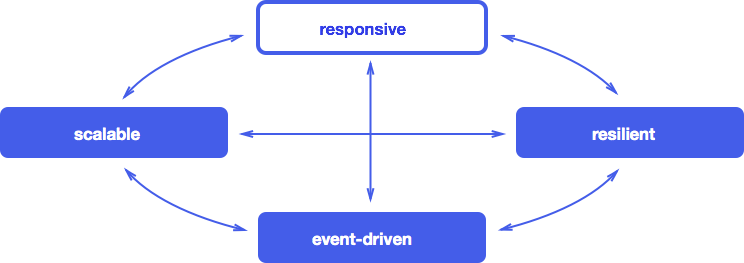

# Lesson 4: The Reactive Manifesto.

Proto.Actor follows the principles first expressed in the reactive programming manifesto. The Reactive Programming Manifesto is a set of principles for creating flexible, loosely coupled and scalable systems. These systems are easy to develop and can be easily modified. They are lower susceptible to failures and react to them with more elegance.

In recent years, application requirements have changed significantly. Dozens of servers, a response time of a few seconds, offline maintenance that might take hours, gigabytes of data - such was the big apps just a few years ago. Today apps work on absolutely everything from simple mobile phones to clusters of thousands of processors. Users are expecting millisecond response time and 100 percent uptime, while the data has grown to petabytes.

Initially, this niche was occupied by large innovative Internet companies such as Google or Twitter, but such application requirements began to pop up in many industries. Financial and telecommunications companies were the first to introduce new practices to meet the new requirements, and now others are being pulled up.

New requirements require new technologies. Previous solutions have focused on managed servers and containers. Scaling was achieved by buying more cool servers and using multithreading. To add new servers it was necessary to handle complicated, inefficient, and expensive proprietary solutions.

However, progress does not stand still. The application architecture has evolved to meet changing requirements. Applications developed based on this architecture are called Reactive Applications. This architecture allows programmers to create event-oriented, scalable, fault-tolerant, and responsive applications — applications that run in real-time and provide excellent response times, based on a scalable and fault-tolerant stack, and that are easy to deploy on multi-core and cloud infrastructures. These features are critical for reactivity.

## Reactive applications

The Merriam Webster dictionary defines reactive as *"ready to respond to external events»* , which means that the components are always active and always ready to receive messages. This definition reveals the essence of reactive applications, focusing on systems that:

- *react to events*
  Event orientation means having the following qualities.
- *react to increased load*
  Focus on scalability, competitive access to shared resources is minimized.
- *react to failures*
  Fault-tolerant systems are created with the ability to recover at all levels.
- react to users*
  Guaranteed response time, regardless of the load.

Each of these characteristics is essential for reactive applications. They all depend on each other, but not as tiers of standard multi-level architecture. Instead, they describe properties that apply across the all technology stack:

Next, we will look at each of these four characteristics in more detail and see how they relate to each other.

## Focus on events

### Why is it important

Applications that use an asynchronous model are much better at providing *Loosely coupling* than applications based on pure synchronous calls. Sender and receiver can be implemented without looking at the details of how events distributed in the system, which allows interfaces to focus on the content of the messages. This leads to an implementation that is easier to expand, modify, and maintain, and it gives greater flexibility and reduces support costs.

Since recipients of asynchronous communication do not act until they receive a message, this approach can allow efficient use of resources, making it possible for many recipients to work in the same thread. Thus, a non-blocking application can have *lower latency* and *more bandwidth* than a traditional application based on blocking synchronization and communication primitives. It leads to lower transaction costs, increased utilization of CPU resources, and makes end users happier.

### Key building blocks

In an event-driven application, components interact with each other by sending and receiving *messages* - discrete parts of information describing facts. These messages are sent and received in asynchronous and non-blocking mode. Event-driven systems are more prone to *push* models than *pull* or *poll*. In other words, they push data to their customers when data becomes available instead of wasting resources by constantly requesting or waiting for data.

- Asynchronous messaging means that an application is inherently highly competitive and can operate on a multi-core architecture without changes. Any CPU core can process any message, which gives more parallelization capabilities.
- Non-blocking means being able to continue to run so that the application is *responsive* all the time, even in the crash or peak load conditions. For this purpose, all resources required for responsiveness, such as CPU, memory, and network, must not be monopolized. It will result in lower latency, higher throughput capacity, and better *scalability*.

Traditional server architectures use shared mutable state and blocking operations on a thread. This makes it difficult to scale the system. The shared mutable state requires synchronization, which adds complexity and nondeterminism, making the code difficult to understand and maintain. Switching a tread to sleep mode requires using limited resources, and waking up operation cost is expensive.

Separating event generation and processing, we allow the platform to take care of the details of synchronization and dispatching of events between threads. At the same time, we focus on higher-level abstractions and business logic. We think about from where and where events are sent and how components interact with each other instead of digging into low-level primitives like threads or locks.

Event-driven systems provide loose coupling between components and subsystems. Such coupling, as we shall see later, is necessary for scalability and fault tolerance. Without complex dependencies between components, system extension requires minimal effort.

When an application requires high performance and high scalability, it is difficult to foresee where bottlenecks may occur. Therefore it is very important that the entire solution is asynchronous and non-blocking. For a typical application, this means that the architecture must be fully event-driven, starting from user requests through the GUI (browser, REST, etc.) and processing requests in a web layer to services, cache and database. If at least one of these layers does not meet this requirement - will make blocking queries to the database, use the publicly available variable state, call expensive synchronous operations - then the entire stack will stall and users will suffer from increased latency and decreased scalability.

The application must be *reactive from top to bottom*.

The need to eliminate the weakest link in the chain is well illustrated. by [Amdal's Law](http://ru.wikipedia.org/wiki/Закон_Амдала), which according to Wikipedia says:

*Acceleration of a program by paralleling it is limited to a sequential part of the program. For example, if 95% of the computation volume can be paralleled, the theoretical maximum of acceleration cannot exceed 20, regardless of the number of processors used.*

## Scalability

### Why is it important

The word scalable is defined by Merriam Webster dictionary as *"capable of easily expanding or modernizing."* The scalable application can be extended to the required scale. This is achieved by giving the application elasticity, a property that allows the system to stretch or shrink (add or remove nodes) on demand. This architecture makes it possible to expand or shrink (deploy on more or fewer processors) without having to rewrite the application. Elasticity minimizes the cost of operating in the cloud, while we only pay for what we use.

Scalability also helps manage risk: too little hardware can lead to dissatisfaction and loss of customersand too much will simply be idle (along with staff) and lead to unnecessary expenses. An even more scalable application reduces the risk of a situation where hardware is available, but the application cannot use it: over the next 10 years, we will have processors with hundreds if not thousands of hardware cores and using their potential requires scalability at a microscopic level.

### Key building blocks

An event-oriented system based on asynchronous message passing is the basis of scalability. Loose coupling and location independence of components and subsystems allow you to deploy the system on multiple nodes while remaining within the same software model with the same semantics. When new nodes added, the throughput of the system increases. In terms of implementation, there should be no difference between deploying a system on more cores or more nodes in a cluster or data center. The application topology becomes a problem of configuration and/or adaptive runtime algorithms that monitor the system load. It is called [location transparency](http://en.wikipedia.org/wiki/Location_transparency).

It is essential to understand that the goal is not to invent transparent distributed computing, distributed objects, or RPC communications — this has been tried before and failed. Instead, we should * cover the network* by presenting it directly in the software model via the asynchronous message mechanism. True scalability naturally relies on distributed computing and its inter-node interaction, which means traversing the network that is inherently [unreliable](http://aphyr.com/posts/288-the-network-is-reliable). Therefore, it is important to explicitly consider the limitations, trade-offs, and exception scenarios in the software model instead of hiding them behind a screen of leaky abstractions that supposedly try to "simplify" things. As a result, it is equally essential to provide yourself with software tools that contain the building blocks for solving typical problems in a distributed environment, such as consensus-building mechanisms or messaging interfaces that have a high level of reliability.

## Fault tolerance

### Why is it important

App failure is one of the most destructive things that can happen to a business. This usually leads to the fact that the service stops working and making a hole in the cash flow. In the long run, this can lead to customer dissatisfaction and bad reputation, which will harm the business even more seriously. Surprisingly, the application fault tolerance requirement is universally ignored or addressed by ad-hoc technicians. This often means that the problem is considered at the wrong level of detail, using too inaccurate and crude tools. A standard solution is to use the clusterization of the application with recovery in case of failures during operation. Unfortunately, such ready-made solutions are costly and, also, dangerous — they can potentially cascade "drop" the entire cluster. The reason is that the problem of managing failures is solved on a map of a very small scale, although it should be worked out in detail at the interaction level of smaller components.

In a reactive application, fault tolerance is not left "for later" but is part of the architecture from the beginning. Treating failures as first-class objects in a software model will make it easier to react to and manage them, making the application tolerant of failures and allowing the system to "heal" and "fix" itself in the process. Traditional methods of handling exceptions cannot achieve this because problems are solved at the wrong levels - we either handle exceptions right where they occur or initiate the entire application recovery process.

### Key building blocks

To manage failures, we need a way to isolate them so that they don't spread to other healthy components, and monitor them from a safe location outside of the context in which failures may occur. One method that comes to mind is bulkheads that divide the system into compartments so that if one of the compartments is flooded (fails), it does not affect the other compartments in any way. This prevents the classic cascading failure problem and allows you to solve problems in isolation.

The event-driven model, which gives scalability, also provides the necessary primitives to solve the problem of fault tolerance. Low coupling in the event-driven model provides us with fully isolated components where failures are encapsulated in messages along with the necessary details and forwarded to other components, which in turn analyze the errors and decide how to respond to them.

This approach creates a system in which:

- business logic remains clean, separate from error handling;
- failures are modeled explicitly so that decomposition, observation, management and configuration are set declaratively;
- the system can "treat" itself and recover automatically.

It is best if the compartments are organized hierarchically, like a large corporation, where the problems are raised to a level with enough power to take appropriate action.

The power of this model is that it is purely event-driven - it is based on reactive components and asynchronous events, and therefore has *location transparency*. In practice, this means that its semantics does not depend on whether it is running on a local server or in a distributed environment.

## **Responsiveness**

### Why is it important

Responsiveness is defined by the Merriam-Webster dictionary as *"responding quickly or responding appropriately"*. Note that we will continue to use this word in its General sense and will not confuse it with [responsive web design](http://en.wikipedia.org/wiki/Responsive_Web_Design) with its CSS [media queries](http://en.wikipedia.org/wiki/Media_queries) and [progressive enhancement](http://en.wikipedia.org/wiki/Progressive_enhancement).

Responsive applications are real-time applications, attractive, rich in functionality and, and provide shared access. Open and continuous dialogue is maintained with clients through responsiveness and interactivity. It does the work of clients more productive, creates a feeling of constancy and readiness at any moment to solve problems and execute problems. One such example is Google Docs, which supports real-time collaborative editing, allowing users to see each other's edits directly.

Applications need to respond to events on time, even in the event of a failure. If an application does not respond within a reasonable time (also known as latency), it is not available and cannot be considered *fault-tolerant*.

Failure to remain within a hard real-time framework for some applications, such as those related to weapons or medicine, is equivalent to a complete system failure. Not all applications have such strict requirements. Many applications quickly become useless if they fail to meet the time requirements; for example, an application conducting trade operations may lose the current trade if it does not respond in time.

More common applications, such as online retail shopping stores, lose profits if the response time increases. Users interact more intensively with *responsive* apps, which leads to more purchases.

### Key building blocks

Reactive applications use observable models, event streams, and clients with a state.

Observable models allow other systems to receive events when their state changes. This provides real-time communication between users and systems. For example, when multiple users are working on the same model simultaneously, changes can be reactively synchronized between them, eliminating the need to lock the model.

Event streams form the basic abstraction on which such relationships built. By keeping them reactive, we avoid blocking and allow conversions and communications to be asynchronous and non-blocking.

Reactive applications must know about [algorithm orders](http://ru.wikipedia.org/wiki/ " O "_ball_and_ " o"small) to make sure that the event response time does not exceed O (1) or at least O(log n), regardless of the load. A zoom level can be enabled, but it should not depend on the number of clients, sessions, products, or transactions.

Here are a few strategies that will help to keep the latency is independent of the load profile:

- In the case of explosive traffic, reactive applications must amortize the cost of expensive operations, such as I/O or competitive data exchange, by applying batching with an understanding and consideration of the specifics of the underlying resources.
- Queues should be limited based on the flow rate, and the length of queues for these response time requirements should be determined according to [little's law](http://en.wikipedia.org/wiki/Little's_law).
- The systems must be monitored at all times and have an adequate safety margin.
- In case of failures, [circuit breakers](http://en.wikipedia.org/wiki/Circuit_breaker_design_pattern)  are activated and run alternate processing strategies.

As an example, consider a responsive web application with "rich" clients (browser, mobile app) to provide the user with a quality interaction experience. This application performs logic and stores a state on the client-side in which the observed models provide a mechanism for updating the user interface when data changes in real-time. Technologies like WebSockets or Server-Sent Events allow the user interface to connect directly to the event stream, so that the entire system becomes event-driven, from the back-end layer to the client. This allows reactive applications to push events to the browser and mobile apps via asynchronous and non-blocking data transfer while maintaining scalability and fault tolerance.

It now becomes clear how the four reactive whales: *event-driven*, *scalable*, *responsive* and *resilient* are linked to each other and form a single whole:

Reactive applications represent a balanced approach to solving modern problems in the development of software systems. They are built on a framework *focused on events* and message passing, and provide tools for *scalability* and *fault tolerance*. On top of this, they support rich and *responsive* user interfaces. We expect the rapidly growing number of systems to be follow this Manifesto in the near future.

