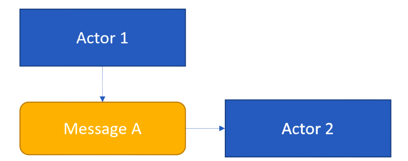
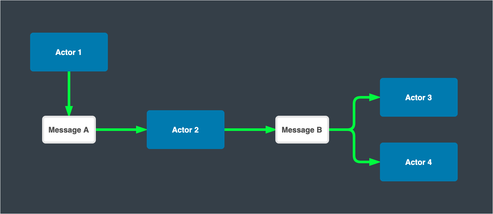

# Lesson 6: Actors and messages.

Before proceeding to a more detailed review of actors and messages. I want to give an overview of how these two concepts fit together.

Actors it's this is the place where our system works. Therefore it is in the actors that we write the entire code of our system. However, one actor alone cannot do much, so we communicate between actors using messages.

Here the first actor creates an instance of a message of type A, and passes it to the second actor.

The second actor then performs some processing, as a result of which it creates a new message with type B, and sends this message to two actors, in this case, actor three and actor four. 

Note here that sending a message from one actor to another is an asynchronous operation. Therefore, once actor one sends a message of type A to actor two, the actor can continue its work. It means that actor one does not have to wait for actor two to finish processing the received message. 

