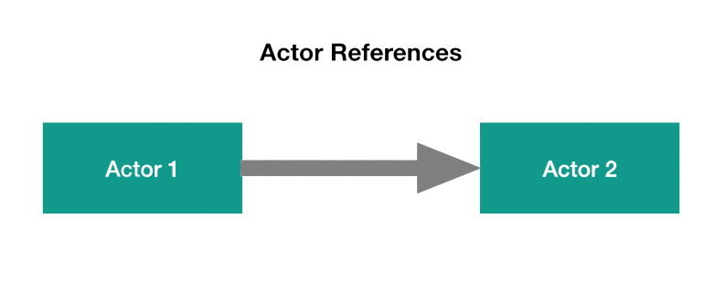
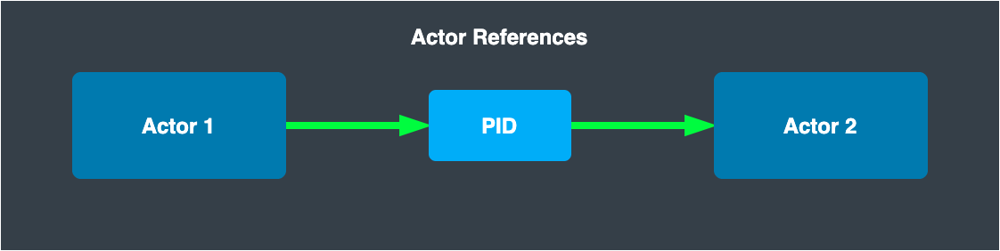
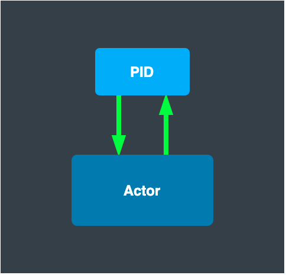
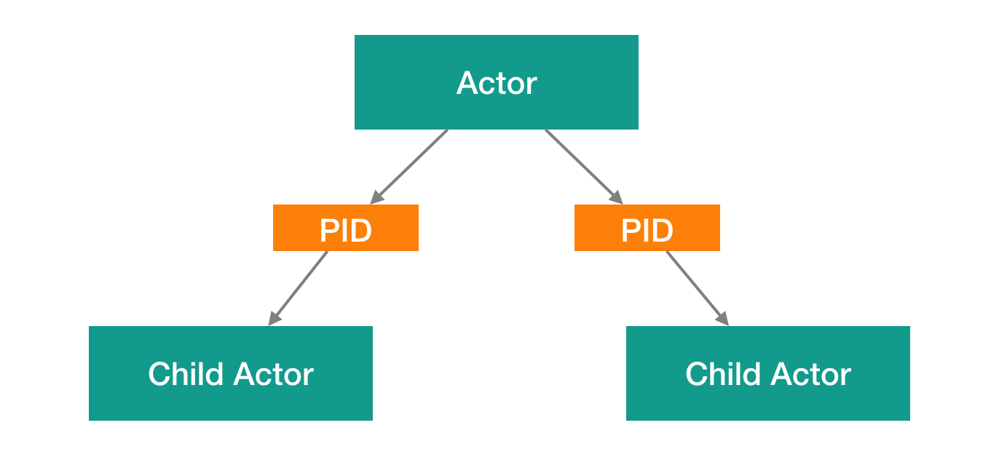
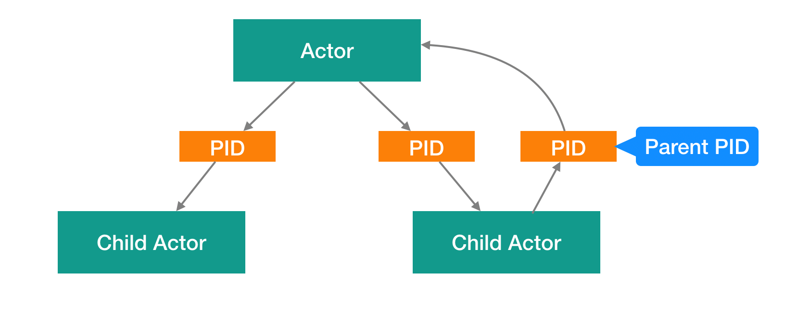

# Lesson 2: Actor References.

In the actors' system, there would be no sense if it did not consist of several actors that interact with each other. As we know from the first module, actors interact with each other by sending messages. So to be able to send a message, one actor needs some reference to another actor.

Here we see that actor 1 wants to send a message to actor 2, in Proto.Actor we don't work with actors directly. Instead, we work with the PID of the actor. The PID is the Process ID of the process.

Each actor has a unique PID that allows Proto.Actor to distinguish actors. When a new actor is created Photo.Actor assigns it the next free ID(i.e., not associated with any actor). ID's are assigned incrementally, i.e., the new actor's ID is higher than the actor created before it. When an actor completes his work, Proto.Actor frees the identifier occupied by it.

Thus, a PID is a layer of abstraction over an actors. And by having this level of abstraction, we can transfer references to actors throughout the system via messages. In addition to that, each actor has several special references to other actors.

The first link is a link to yourself. Since a PID is an abstraction above an actor. We can use our PID to send a message to yourself. For example, you may need to do this when you want to send a message to yourself that delayed in time.

The next special link that our actor has is a link to his child actors. For example, our actor has created two child actors. And you can use those links to stop or restart the child actors.

And the last link that interests us. This is a reference to the parent. That is, child actors can communicate with their parents. For example, the child actor can notify the parent that an error has occurred while processing the message.

Now you know that Proto.Actor does not use direct links to other actors instead we have an abstraction over actors called PID.

In Proto.Actor, the primary way to get the PID of an actor, is to create a new actor. That is, after creating a child or root actor, Proto.Actor returns the PID of the newly created actor. You can use this PID to send messages to this actor.

