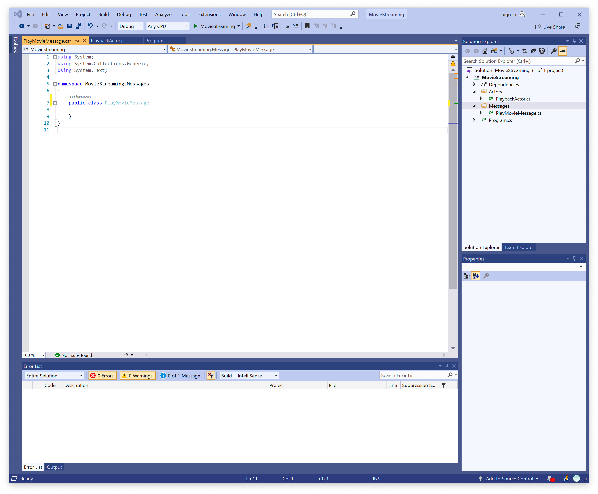

# Lesson 7: Sending a Custom Message.

From this lesson, you will learn how to create a custom message and send it to our author. You will also learn how to modify our actor so that it can work with custom messages.

For more comfortable work, let's modify our project a bit, for this purpose, let's go to our IDE and create two folders. The first folder will be called Actors, and we will store all our actors in it. The second folder will be called Messages, and it will contain all our custom messages.

Next, let's move PlaybackActor to a separate file in the Actors folder. Then let's create a new PlayMovieMessage class in the Messages folder. In the end, our project should look like this.



Now we can begin to study user messages in more detail. As mentioned earlier in this course, custom messages should not be inherited from any special base class. 

So, all you need to do to create a custom message is to define the properties and the constructor that will initialize these properties.

Let's look at this process in more detail. In the previous lesson, we passed two messages to our actor. Now let's icing these messages into one. 

First, let's add two properties to our user message, the first property of MovieTitle, which is a string describing the movie title. The second property, `UserId` contains a user ID.

```c#
public class PlayMovieMessage
{
     public string MovieTitle { get; }
     public int UserId { get; }
}
```

Next, we need to add a class constructor that will initialize these properties with the passed values. In the end, we should get the following code.

```c#
public class PlayMovieMessage
{
     public string MovieTitle { get; }
     public int UserId { get; }
  
     public PlayMovieMessage(string movieTitle, int userId)
     {
         MovieTitle = movieTitle;
         UserId = userId;
     }
}
```

After we have created a user message, let's change our code from the previous lesson to work with our custom message. To start with, change the `Program` class so it can send our message.

```c#
class Program
{
    static void Main(string[] args)
    {
        var system = new ActorSystem();
        Console.WriteLine("Actor system created");

        var props = Props.FromProducer(() => new PlaybackActor());
        var pid = system.Root.Spawn(props);

        system.Root.Send(pid, new PlayMovieMessage("The Movie", 44));

        Console.ReadLine();
    }
}
```

Next, let's change the PlaybackActor code so that it can recognize and process `PlayMovieMessage`.

```c#
public class PlaybackActor : IActor
{
    public PlaybackActor() => Console.WriteLine("Creating a PlaybackActor");
  
    public Task ReceiveAsync(IContext context)
    {
        switch (context.Message)
        {
            case PlayMovieMessage msg:
                Console.WriteLine($"Received movie title {msg.MovieTitle}");
                Console.WriteLine($"Received user ID {msg.UserId}");
                break;
        }
        return Actor.Done;
    }
}
```

As you can see, all we did was change the message type in the switch statement and add extraction of values from the message properties.

If we run our application, we can make sure that it is no different from what we did in the previous lesson.


Also, the Proto.Actor platform allows you to create messages based on gRPC technology, allowing actors written in different programming languages to communicate between themselves. But we will talk about this in the next lessons.