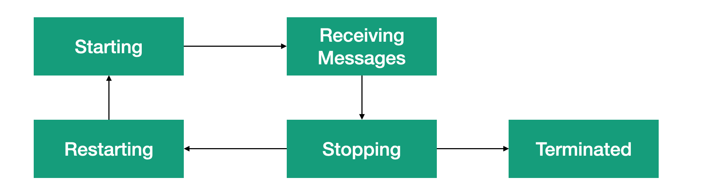

# Lesson 1: Actor Lifecycle.

Let's start studying this module by considering the stages of the actor's life cycle.

### Stage № 1 Starting

At the start stage, the actor initialized in our actor system. In other words, the instance of our actor is created, and a link to it saved in our actor system.

After the actor was created, the actor system will send to our actor a system message Started. What to run the method `ProcessMessageAsync()`. That allows you to process the start stage of the actor.

### Stage № 2 Receiving Messages.

At this stage, our actor is fully initialized and awaiting incoming messages for processing.

### Stage № 3 Stopping.

At some point, our actor may go into a stop state. The transition to this state can happen in several cases.

1. If for some reason you decide to call the `ActorContext.Stop()` and `ActorContext.StopAsync()` methods from your business logic.
2. If an error occurred, in the actor's hierarchy. The parent class can send a stop message.

The process of stopping an actor can be divided into two sub-stages.

**The first stage is called Stopping.**

At this stage, the preparation for the actor's stop begins. This stage involves stopping the child actors and calling the `ProcessMessageAsync()` method with the system message `Stop`. This allows you to know about the stop of the actor and process it in your code.

**The second stage is called Stop.**

In this stage, the actor is completely stopped, and all resources used by it are released.

### Stage № 4  Restarting.

The restarting stage of the actor is no different from the stop stage except that the actor will go to the Starting stage after the stop stage. At this stage, your code will receive the system message `Restart`. 

### Stage № 5 Terminated.

The last stage of the actor's life cycle is called Terminated. At this stage, our actor is dead. That is, it can no longer receive and process messages, and the actor cannot be reloaded. Before the actor will be completely disabled, the method `ProcessMessageAsync()` will receive the system message `Terminated`. 

So that if necessary, you can finish your actor's work correctly and release the used resources. 

Graphically, the life cycle of an actor can be represented as follows.

We will consider the processing of system messages of the actor's life cycle in the next lesson.

