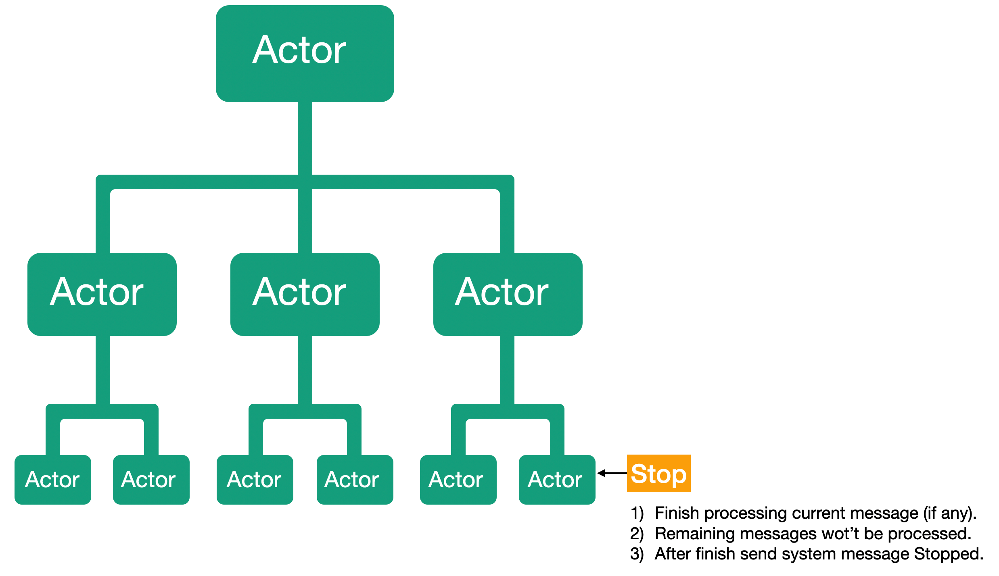
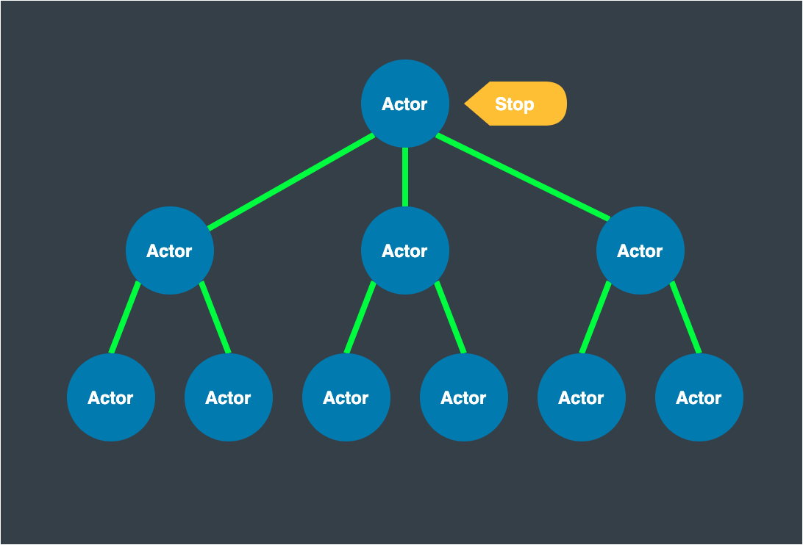
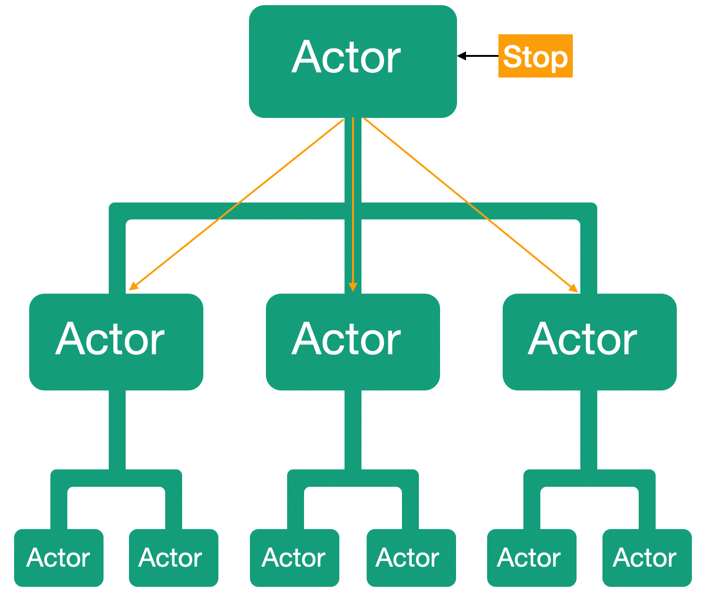
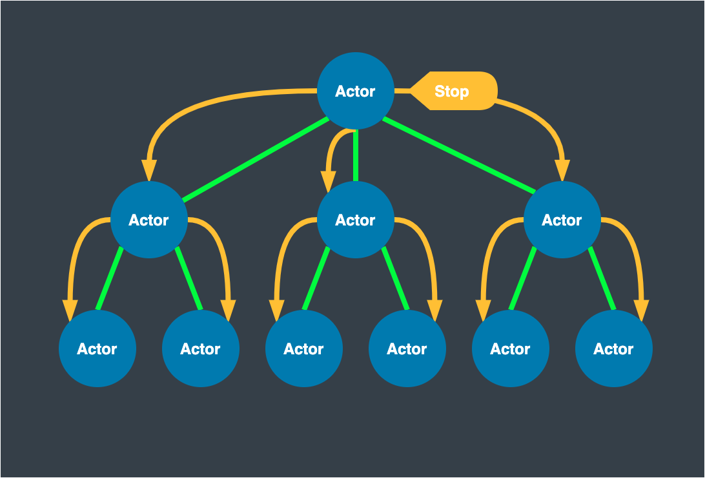

# Lesson 3: Terminating Actors and Hierarchy of Actors.

So let's see what happens when our actor completes his work. And what happens to the hierarchy of actors, if our actor was part of that hierarchy.

When we terminate the actor, for example, by sending a `Stop ' message, the first thing that happens is to stop processing all incoming user messages. In other words, incoming messages will no longer be retrieved and processed from the mailbox. An exception will be made only for message that are already being processed. Once its processing will be complete, no more messages will be processed.

All messages sent to the stopped actor address will be redirected to a special channel called `DeadLetter'.

After the actor will be completely stopped, we will receive the system message Stopped() from now on our actor is dead.

What happens if we stop an actor who has children actors? Let's send a stop message to our main actor and see what happens.

If an actor has child actors, the actor will send them a stop message.

If the child actors have their child actors, then the child actors will send a stop message to their child actors.

Only after the child actors are completely stopped will the parent actor receive the `Stopped () ' message. This way we have an ordered and controlled way to stop actors.

The Proto.Actor platform provides several ways to stop actors. But the main one is to call the `Stop(PID)` method with the actor's PID to be stopped.