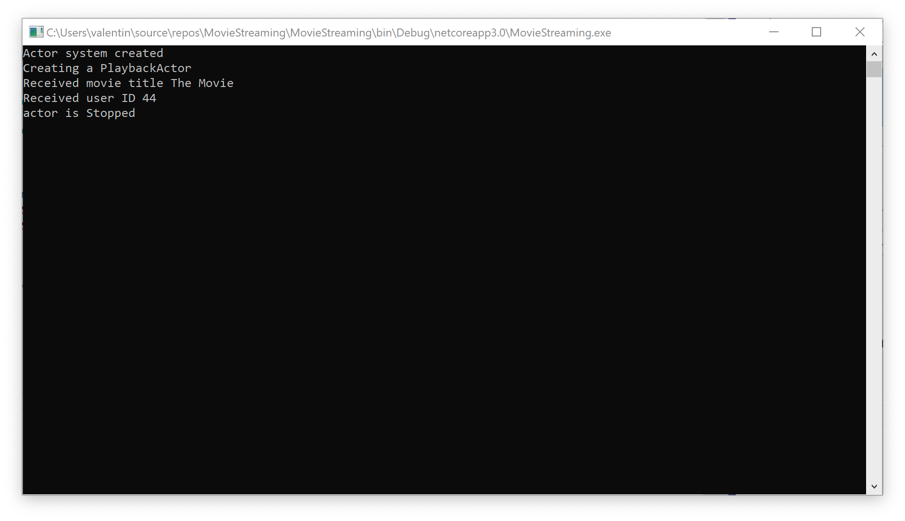

# Lesson 4: What is the Poison Pill message and how to work with it.

In this lesson, we will consider the `PoisonPill()` message and how it differs from the `Stop()` message.

`Stop()` and `PoisonPill()` messages used to terminate the actor and stop the message queue. Both of these messages force the actor to stop processing incoming messages, and send a stop message to all of its child actors, and wait until they are finished. Then, send our code a message `Stopped()` that signals the actor's complete shutdown. Keep in mind that all future messages sent to our actor's address will be forwarded to dead letters mailbox.

`Stop()` and `PoisonPill()` messages used to terminate the actor and stop the message queue. Both of these messages force the actor to stop processing incoming messages, and send a stop message to all of its child actors, and wait until they are finished. Then, send our code a message `Stopped()` that signals the actor's complete shutdown. Keep in mind that all future messages sent to our actor's address will be forwarded to dead letters mailbox.

Let's see how we can send a message `PoisonPill()` to our actor `PlaybackActor()`.

Let's open our project and add the sending of the message `PoisonPill()` to the class `Program()`. You can do it with the help of 

```c#
system.Root.Poison(pid);
```

As a result, we should get the following code.

```c#
class Program
{
    static void Main(string[] args)
    {
        var system = new ActorSystem();
        Console.WriteLine("Actor system created");

        var props = Props.FromProducer(() => new PlaybackActor());
        var pid = system.Root.Spawn(props);

        system.Root.Send(pid, new PlayMovieMessage("The Movie", 44));

        system.Root.Poison(pid);

        Console.ReadLine();
    }
}
```

Now we need to edit the `PlaybackActor() 'so that it can handle the `Stopped ()' message.

```c#
public class PlaybackActor : IActor
{
    public PlaybackActor() => Console.WriteLine("Creating a PlaybackActor");
    public Task ReceiveAsync(IContext context)
    {
        switch (context.Message)
        {
            case PlayMovieMessage msg:
                Console.WriteLine($"Received movie title {msg.MovieTitle}");
                Console.WriteLine($"Received user ID {msg.UserId}");
                break;

            case Stopped msg:
                Console.WriteLine("actor is Stopped");
                break;
        }
        return Actor.Done;
    }
}
```

Let's launch our app and see what happened.



Как вы видите актор успешно завершил свою работу.