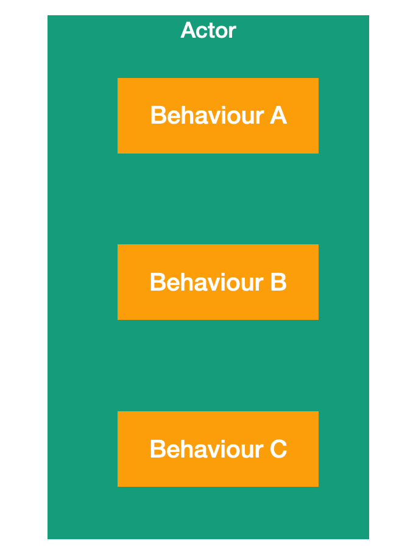
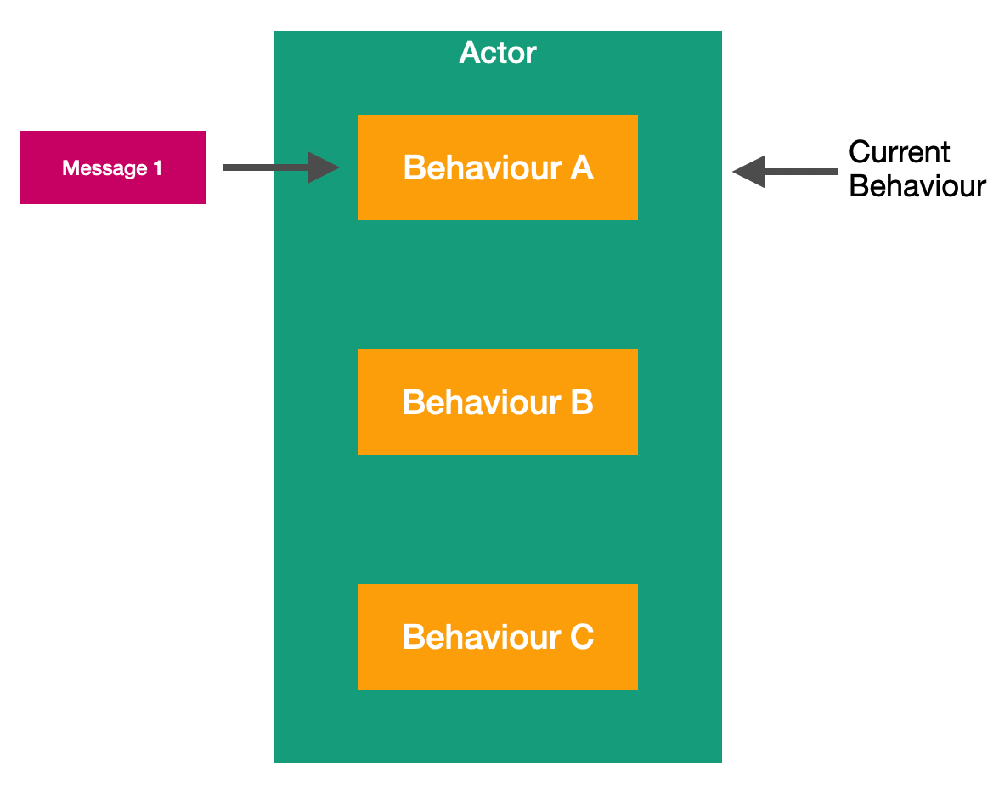
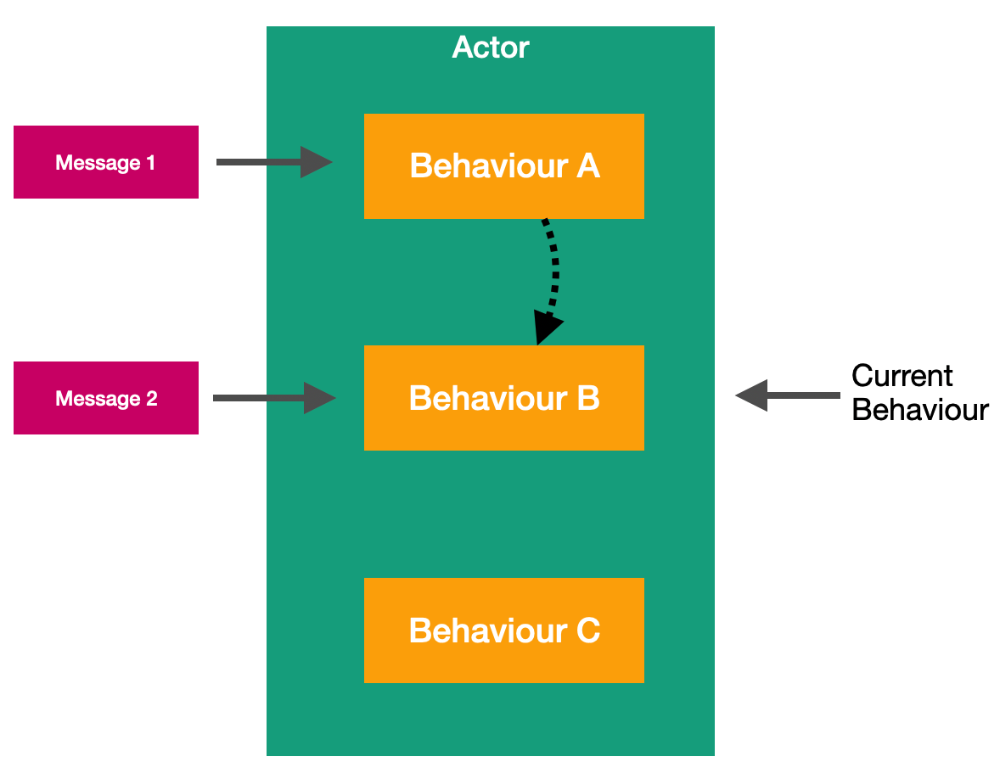

# Lesson 5: Switchable Actor Behavior.

Earlier in our course, we already mentioned four key features of the actor. One of these features is the ability to change behavior when processing the next message.


Such switchable actor behavior allows us to represent different behavioral states in which our actor may be located. Without using the if and else operator. 

For example, we have an actor who has three types of behavior. Behavior A, B, and C.



When we create an instance of our doctor, it is automatically initialized by behavior A. When the actor receives the first message, and it will be processed according to the logic of behavior A.



During the processing of this message, the actor can change its behavior to another. Thus, in this example, it switches from behavior A to behavior B. 


Now, when the actor receives a new message, it will use the business logic from behavior B to process this message.



If there is a logic in behavior B that switches the actor on behavior C, then when the next message is received, the actor will process it using the algorithms contained in behavior C.

To work with  behavior in the Proto.Actor platform there is a special class ` Behavior()`. You can use this class in your actor to change the Behavior of your actor at runtime dynamically.

Work with the class ` Behavior() ` consists in transfer to it, methods realizing business logic of behaviour. You can pass the appropriate methods either at the stage of creating an instance of the `Behavior()` class using the class constructor or using methods `Behavior.Become()` and `Behavior.BecomeStacked()`. The difference between `Behavior.Become()` and `Behavior.BecomeStacked()` method is that the `Behavior.Become()` method clears the stack before adding new behavior. In its turn, the `Behavior.BecomeStacked()` method adds new behavior to the stack without removing previously added items. To remove the behavior from the `Behavior()` class, there is the `Behavior.BecomeStacked()` method. 

For our actor to use the `Behavior()` class when processing incoming messages, we need to pass all incoming messages to the `Behavior.ReceiveAsync()` method. We can do it in the following way.

```c#
public Task ReceiveAsync(IContext context) => Behavior.ReceiveAsync(context);
```

In the next lessons, we will look at real-life examples of how the `Behavior()` class can be used in our actors.

