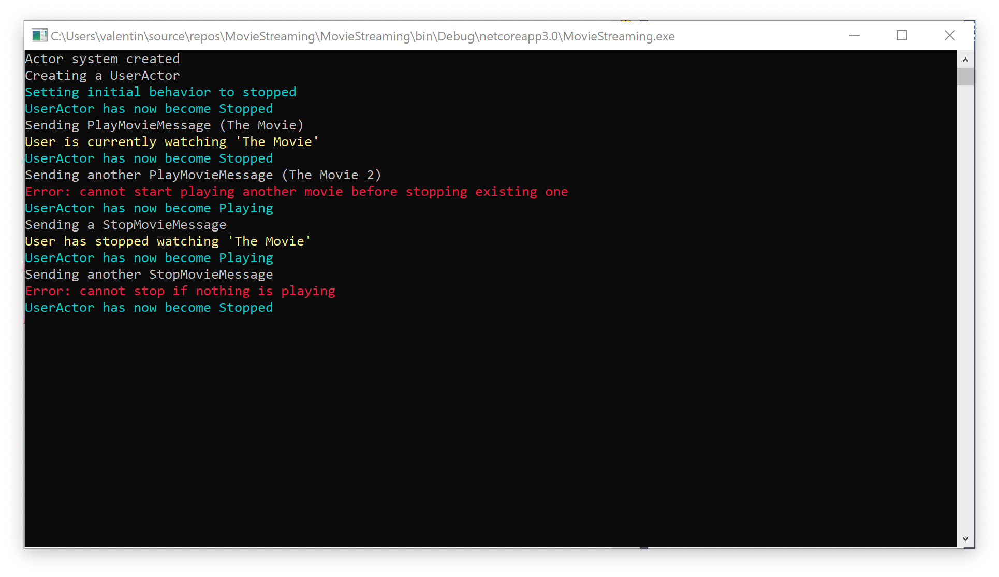

# Lesson 6: Refactoring with using behavior switching.

In this lesson, we will add new functionality to our app. This functionality will consist in the fact that we will emulate the start and stop of the movie playback by the user. To implement this functionality, we will use the behavior.

The first thing we need to do is create a new message called `StopMovieMessage()`. This message will signal to our actor that the user has decided to stop watching the movie. 

After that, we need to create a new actor that will be directly responsible for starting and stopping the movie. We will call this actor `UserActor()`.

First of all, let's add a constructor to our actor. In the constructor, we create an instance of the `Behavior()` class and initialize it with the default behavior.

```c#
public UserActor()
{
    Console.WriteLine("Creating a UserActor");
    ColorConsole.WriteLineCyan("Setting initial behavior to stopped");
    _behavior = new Behavior(Stopped);
}
```

Now let's create two methods to represent two different types of behavior. Behavior to play a movie and behavior to stop playing a movie. Keep in mind that any method that will be responsible for the behavior of the actor must implement a specific delegate.

```c#
public delegate Task Receive(IContext context);
```

The first thing we need to do is add the private `Playing () ' method to our actor. This method will be a behavior for playing the movie.

```c#
private Task Playing(IContext context)
{
    switch (context.Message)
    {
        case PlayMovieMessage msg:
            ColorConsole.WriteLineRed("Error: cannot start playing another movie before stopping existing one");
            break;
         case StopMovieMessage msg:
            ColorConsole.WriteLineYellow($"User has stopped watching '{_currentlyWatching}'");
            _currentlyWatching = null;
            _behavior.Become(Stopped);
            break;
    }
    ColorConsole.WriteLineCyan("UserActor has now become Playing");

    return Actor.Done;
}
```

After receiving a message, our method uses the `switch` operator to select the appropriate business logic to process the message. Let's take a more detailed look at how `StopMovieMessage` handles a message. How do you see, after the necessary business logic is processed, the behavior switches to `Stopped`. 

`_behavior.Become(Stopped);`

It means that the next message will be processed not in the `Playing () ' method, and in the method `Stopped ()`. Recall that the `Stopped()` method is used to implement the behavior of stopping movie viewing. Let's see in this method more detail.

```c#
private Task Stopped(IContext context)
{
    switch (context.Message)
    {
        case PlayMovieMessage msg:
            _currentlyWatching = msg.MovieTitle;
            ColorConsole.WriteLineYellow($"User is currently watching '{_currentlyWatching}'");
            _behavior.Become(Playing);
            break;
        case StopMovieMessage msg:
            ColorConsole.WriteLineRed("Error: cannot stop if nothing is playing");
            break;
     }
     ColorConsole.WriteLineCyan("UserActor has now become Stopped");

     return Actor.Done;
}
```

As we can see in the code block responsible for processing the message 'PlayMovieMessage ()' there is a code for switching the behavior to the `Playing 'behavior. In turn, the `Playing' behavior will switch to the `Stopped` behavior under certain conditions. In other words, our actor is a classical finite state machine with two States.

As a result, our actor should look like this.

```c#
public class UserActor : IActor
{
    private string _currentlyWatching;

    private readonly Behavior _behavior;

    public UserActor()
    {
        Console.WriteLine("Creating a UserActor");
        ColorConsole.WriteLineCyan("Setting initial behavior to stopped");
        _behavior = new Behavior(Stopped);
    }

    public Task ReceiveAsync(IContext context) => _behavior.ReceiveAsync(context);

    private Task Stopped(IContext context)
    {
        switch (context.Message)
        {
            case PlayMovieMessage msg:
                _currentlyWatching = msg.MovieTitle;
                ColorConsole.WriteLineYellow($"User is currently watching '{_currentlyWatching}'");
                _behavior.Become(Playing);
                break;
            case StopMovieMessage msg:
                ColorConsole.WriteLineRed("Error: cannot stop if nothing is playing");
                break;
        }
        ColorConsole.WriteLineCyan("UserActor has now become Stopped");

        return Actor.Done;
    }

    private Task Playing(IContext context)
    {
        switch (context.Message)
        {
            case PlayMovieMessage msg:
                ColorConsole.WriteLineRed("Error: cannot start playing another movie before stopping existing one");
                break;
            case StopMovieMessage msg:
                ColorConsole.WriteLineYellow($"User has stopped watching '{_currentlyWatching}'");
                _currentlyWatching = null;
                _behavior.Become(Stopped);
                break;
        }
        ColorConsole.WriteLineCyan("UserActor has now become Playing");

        return Actor.Done;
    }
}
```

Now, all we have to do is change the `Program()` class to send us the necessary messages.

```c#
class Program
{
    static void Main(string[] args)
    {
        var system = new ActorSystem();
        Console.WriteLine("Actor system created");

        var props = Props.FromProducer(() => new UserActor());
        var pid = system.Root.Spawn(props);


        Console.ReadKey();
        Console.WriteLine("Sending PlayMovieMessage (The Movie)");
        system.Root.Send(pid, new PlayMovieMessage("The Movie", 44));
        Console.ReadKey();
        Console.WriteLine("Sending another PlayMovieMessage (The Movie 2)");
        system.Root.Send(pid, new PlayMovieMessage("The Movie 2", 54));

        Console.ReadKey();
        Console.WriteLine("Sending a StopMovieMessage");
        system.Root.Send(pid, new StopMovieMessage());

        Console.ReadKey();
        Console.WriteLine("Sending another StopMovieMessage");
        system.Root.Send(pid, new StopMovieMessage());

        Console.ReadLine();
     }
}
```

Let's run our program and see what did we get.

