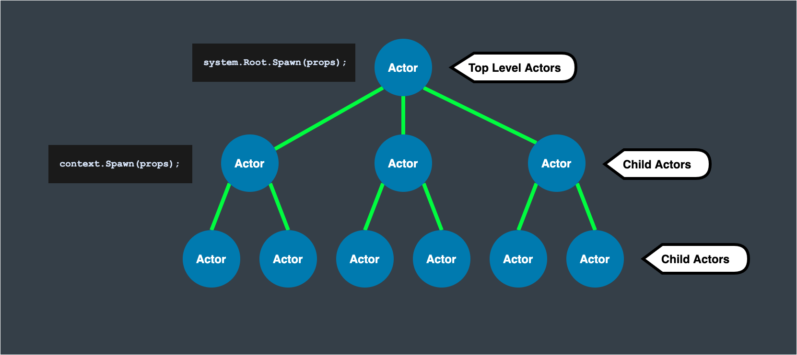

# Lesson 1: Supervisor and actor hierarchy.

Let's start this module with a deeper dive into the hierarchy of actors and the supervisor's concept. 

In the first module of our course, we have already learned the basic concepts of the actor's hierarchy and supervisor. When our actor had children, and for them, our actor was a parent actor.

The hierarchy of supervisors defines the order in which actors are created by each other: each actor that creates other actors is a supervisor for the child actors that it creates.

The hierarchy stays fixed throughout the life cycle of the child actor. Once created by a parent, the child actor is under constant supervision of the parent until it stops; there is no such thing as adoption in Proto.Actor. The only way for the supervisor to give up parental responsibilities is to stop the child actor. This is why it is so important to choose the correct actor hierarchy in the application from the start, especially if you do not plan to stop parts of the hierarchy to replace them with completely different subtrees of actors.

The actors most at risk (for whom crashes are most likely) should be in a hierarchy as low as possible. Errors that occur deep in the hierarchy can be handled by more supervisors than those that occur closer to the top. When an error occurs at the top level of the actor system, it may cause restart of all the top level actors or even stop the actor system.

To create root actors, we use the method.

`system.Root.Spawn(props);`

After we have created root actors from the code of root actors, we can create their child actors using the method.

`context.Spawn(props);`

Now that you've learned a bit more about the hierarchy of supervisors. Let's move on to the next lesson, where we'll see how to implement the actors' hierarchy in practice.