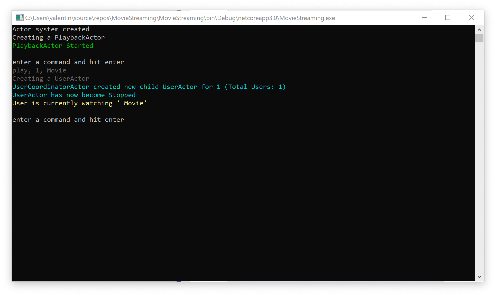

# Lesson 4: Creating UserCoordinatorActor.

So, let's begin creating the final architecture for our application. In this lesson, we will add `UserCoordinatorActor()` to our actor hierarchy. This actor will be responsible for creating child actors and sending them various messages.


First of all, we will need to do a little preparatory work. First, we need to add the UserId to the `StopMovieMessage () ' message.

```c#
public class StopMovieMessage
{
    public int UserId { get; private set; }

    public StopMovieMessage(int userId)
    {
        UserId = userId;
    }
}
```

Now let's add UserId to the `UserActor()` class.

```c#
 public class UserActor : IActor
 {
        private int _id;
   
				public UserActor(int id)
        {
            _id = id;
        }
```

Next, we need to add a couple of messages to the Messages folder. The first message will be called `RequestActorPid()`. And it will will be used to request the Pid of the desired actor.

```c#
public class RequestActorPid
{
}
```

The second message called `ResponseActorPid()` is used to respond to `RequestActorPid()` and contains the Pid of the desired actor.

```c#
public class ResponseActorPid
{
    public PID Pid { get; }

    public ResponseActorPid(PID pid)
    {
        Pid = pid;
    }
}
```

Now we can start creating the `UserCoordinatorActor()` class. Let's go to the Actors folder and add the class `UserCoordinatorActor()`.

```c#
public class UserCoordinatorActor : IActor
{
    private readonly Dictionary<int, PID> _users = new Dictionary<int, PID>();

    public Task ReceiveAsync(IContext context)
    {
        switch (context.Message)
        {
            case PlayMovieMessage msg:
                ProcessPlayMovieMessage(context, msg);
                break;

            case StopMovieMessage msg:
                ProcessStopMovieMessage(context, msg);
                break;
        }
        return Actor.Done;
    }

    private void ProcessPlayMovieMessage(IContext context, PlayMovieMessage msg)
    {
        CreateChildUserIfNotExists(context, msg.UserId);
        var childActorRef = _users[msg.UserId];
        context.Send(childActorRef, msg);
    }

    private void CreateChildUserIfNotExists(IContext context, int userId)
    {
        if (!_users.ContainsKey(userId))
        {
            var props = Props.FromProducer(() => new UserActor(userId));
            var pid = context.SpawnNamed(props, $"User{userId}");
            _users.Add(userId, pid);
            ColorConsole.WriteLineCyan($"UserCoordinatorActor created new child UserActor for {userId} (Total Users: {_users.Count})");
        }
    }

    private void ProcessStopMovieMessage(IContext context, StopMovieMessage msg)
    {
        CreateChildUserIfNotExists(context, msg.UserId);
        var childActorRef = _users[msg.UserId];
        context.Send(childActorRef, msg);
    }
}
```

As you can see, this actor checks that a suitable child actor exists. If the actor does not exist, our actor creates it and then adds a link to it in the `_users' dictionary. Then using this dictionary, it extracts a link to the appropriate actor and sends it a message.

Now we need to make a change to the `PlaybackActor()` so that it can create an instance of the `UserCoordinatorActor()` class and save a link to it.


To do this, make the necessary changes to the `ProcessStartedMessage` method so that it creates a child actor `UserCoordinatorActor()` and saves the link immediately after it is created.

```c#
 public class PlaybackActor : IActor
 {
        private PID _userCoordinatorActorRef;
   
        private void ProcessStartedMessage(IContext context, Started msg)
        {
            ColorConsole.WriteLineGreen("PlaybackActor Started");

            var props = Props.FromProducer(() => new UserCoordinatorActor());
            _userCoordinatorActorRef = context.Spawn(props);
        }
```

And also add the RequestActorPid handler to `PlaybackActor()`.

```c#
public Task ReceiveAsync(IContext context)
{
    switch (context.Message)
    {
        case Started msg:
            ProcessStartedMessage(context, msg);
            break;

        case PlayMovieMessage msg:
            ProcessPlayMovieMessage(msg);
            break;

        case Recoverable msg:
            ProcessRecoverableMessage(context, msg);
            break;

        case Stopping msg:
            ProcessStoppingMessage(msg);
            break;

        case RequestActorPidMessage msg:
            ProcessRequestActorPidMessage(context, msg);
            break;
     }
     return Actor.Done;
}
```

So that 'PlaybackActor ()' can send a link to its child actor when requested.

```c#
private void ProcessRequestActorPidMessage(IContext context, RequestActorPidMessage msg)
{
    context.Respond(new ResponseActorPidMessage(_userCoordinatorActorRef));
}
```

Now, all we have to do is add the ability to manage our app using commands from the console. To do this, let's open our `Program()` class and make the necessary changes.

```c#
class Program
{
    static async Task Main(string[] args)
    {
        var system = new ActorSystem();
        Console.WriteLine("Actor system created");

        var props = Props.FromProducer(() => new PlaybackActor());
        var playbackPid = system.Root.Spawn(props);

        var actorPidMessage = await system.Root.RequestAsync<ResponseActorPidMessage>(playbackPid, new RequestActorPidMessage());
        var userCoordinatorActorPid = actorPidMessage.Pid;

        do
        {
            ShortPause();

            Console.WriteLine();
            Console.ForegroundColor = ConsoleColor.DarkGray;
            ColorConsole.WriteLineGray("enter a command and hit enter");

            var command = Console.ReadLine();

            if (command != null)
            {
                if (command.StartsWith("play"))
                {
                    var userId = int.Parse(command.Split(',')[1]);
                    var movieTitle = command.Split(',')[2];

                    system.Root.Send(userCoordinatorActorPid, new PlayMovieMessage(movieTitle, userId));
                }
                else if (command.StartsWith("stop"))
                {
                    var userId = int.Parse(command.Split(',')[1]);

                    system.Root.Send(userCoordinatorActorPid, new StopMovieMessage(userId));
                }
                else if (command == "exit")
                {
                    Terminate();
                }
            }
        } while (true);

        static void ShortPause()
        {
            Thread.Sleep(250);
        }

        static void Terminate()
        {
            Console.WriteLine("Actor system shutdown");
            Console.ReadKey();
            Environment.Exit(1);
        }
    }
}
```

As you can see, commands are read from the console and converted to appropriate messages, and next sent to the `UserCoordinatorActor()` actor.

Let's run our project and see what happened.



When you enter the command "play,1, Movie" the movie starts playing.


When you re-enter the same command, you will receive an error message since the movie playback is already running.

If we want to stop it playing, we should type "stop".

