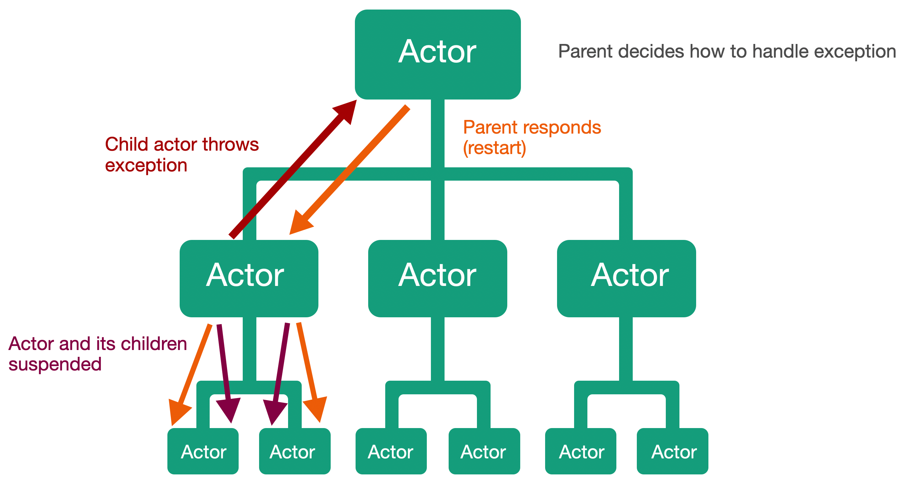

# Lesson 6: How parent actors are watching over their children actors.

One of the actor system features is that the system has fault tolerance and the ability to recover from failures automatically. This is achieved through parental control, where the parent actor controls the state of their children's actors.

Parental control is that when an actor throws an exception, the first thing that happens is that the actor itself and all its child actors will be suspended from handling the messages. And next the message about the error in the child actor will be passed to its parent actor.

The parent actor will decide how to handle this error and then sends a message to the child actor, with instructions on what to do in this situation. There are many different strategies for handling exceptions in child actors. For example, a parent actor can restart a child actor if an error occurs in it.

You should also keep in mind. If the child actor has its own child actors, the restart message will also be sent to its child actors, and on down the actor hierarchy. 

Let's look at the various error handling strategies that a parent actor can offer for their child actors.

#### Resumption of work.

The first strategy that a parent actor can choose. It is to let their child try to resume processing messages. This means that the exception that caused the error in the child actor will be ignored. 

But we can save this error message in the log for later analysis to avoid such errors in the future. You should also keep in mind that when you resume the actor's work, its inner state is being saved. 

Let's go back to our example with the movies. For example. If an error happens in the actor that is responsible for calculating the number of films played. Then when we were restoring his work, the actor will remember all previously played movies. Also, keep in mind that when we resume the child actor that generated the error, all its child actors will also be resumed.  

#### Restart.

If the parent actor decides that the child actor's state is corrupted and we can no longer resume it, in this case, we must restart it from scratch. When a child actor is restarted, its internal state will be lost.

If we go back to our example with the actor to count the number of times you watch a movie, then on rebooting the actor will lose all previously counted movies and the number of playback for movies will start counting from zero. When we restart the actor that generated the exception, it will also restart all its child actors.

Also keep in mind that when we restart our actor, it will lose its internal state, but will not lose any of the remaining messages in its mailbox. When it restarts, it will continue to process the next message. 

#### Full stop.

The parent actor can also stop the child actor completely, which will result in the complete stopping of all child actors of our actor.

#### Delegation of decision making to a higher level.

Finally, the parent actor can choose to delegate decision - making to a higher level, meaning that the decision about what to do is passed one level up the parent-child hierarchy. If the parent actor decides to move the decision to a higher level, the parent actor itself will be suspended. When a parent actor is suspended, all its child actors, in addition to the one that has already generated an exception, will also be suspended.

