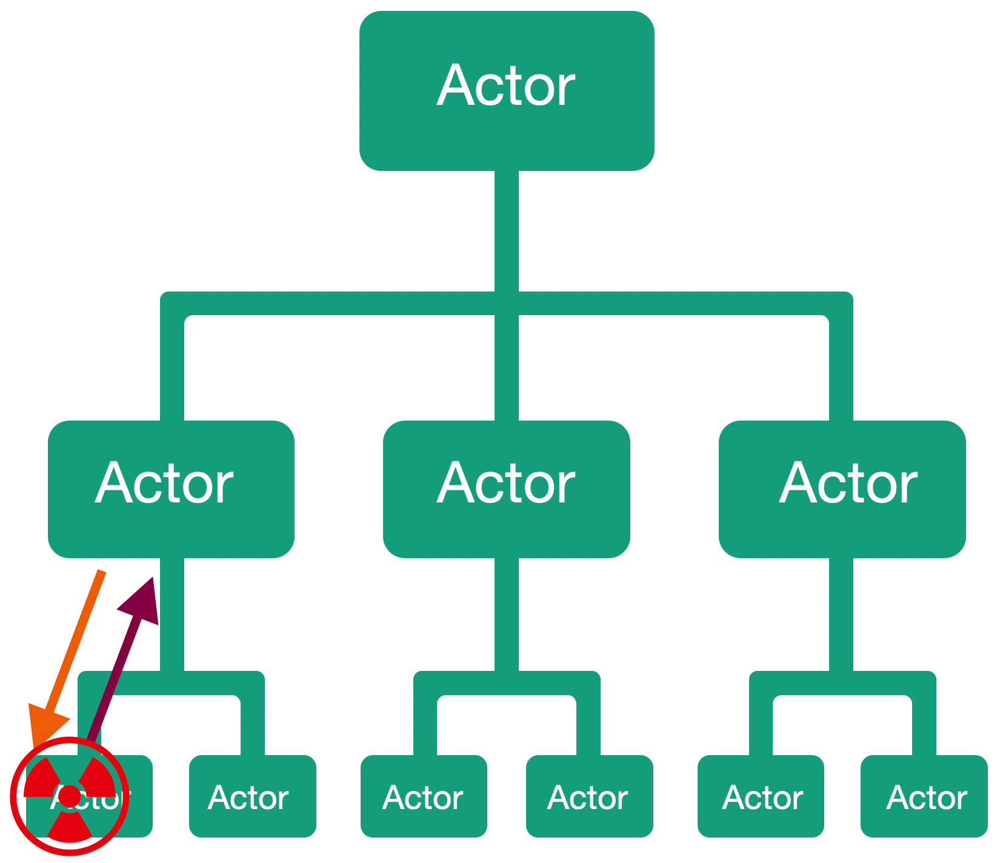

# Lesson 7: Strategies to control the state of children's actors.

In the previous lesson, we learned that parent actors can monitor their child actors' status and correct it if necessary. In this lesson, we will learn what mechanisms are used for this monitoring. 

When we create our actor using the Props.Spawn() method. We automatically get the child actor supervision strategy that is pre-installed in the Proto.Actor platform. If necessary, you can override this strategy and set your own strategy to work with your child actors using the `WithChildSupervisorStrategy()` method.

Thus, the child actor monitoring strategy takes an incoming message containing an exception generated by the child actor and, depending on the business logic contained in the strategy, issues the most appropriate directive for the current situation.

For example, this Directive can be a command to restart a child actor, as discussed in the previous lesson. In addition to writing your strategy to control the state of child actors, you can also write a method to implement the Decider delegate.

`public delegate SupervisorDirective Decider(PID pid, Exception reason);`

Built-in strategies will use this method for decision making. For example, you can specify the maximum number of exceptions upon reaching which a child actor will be stopped.

There are several built-in strategies for controlling child actors in the Proto.Actor platform, let's look at them in more detail.

#### OneForOneStrategy strategy.

This strategy will apply the Directive received from the Decider method only to the child actor that generated the exception. For example, if the Directive is to stop a child actor, only that child actor will be stopped. This strategy is applied by default when creating a new actor.

#### AllForOneStrategy strategy.

Unlike the OneForOneStrategy strategy, the AllForOneStrategy strategy applies the resulting Directive to all child actors, not just the actor that generated the exception. For example, here, as before, our child actor generates an exception, but this time the resulting Directive applies not only to the child actor that generated the exception but also to all other child actors of this parent actor.

The AllForOneStrategy strategy can be useful if we have child actors that are highly dependent on each other. For example, if an error occurred in one of the child actors, the other child actors would not be able to perform their work. Thus, AllForOneStrategy allows you to take corrective actions for all child actors, not just for the actor that failed.