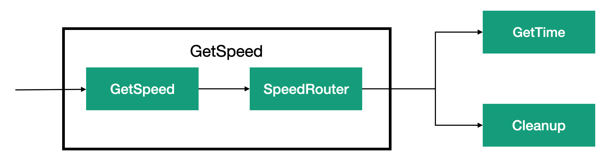

# Lesson 6. Implementation of the router pattern with using actors.

Implementing a router pattern does not always require using the built-in routers of the Proto.Actor platform. When the route selection depends on the message content or some state, it is easier to implement a standard actor, because this approach allows you to use all the advantages of actors. Also, if you decide to create your router similar to Proto.Actor routers,you will have to solve problems related to multi-thread processing.

In this lesson we will consider several implementations of the router pattern using standard actors. We will start with the version that performs routing by message content. In the next section we will use the become/unbecome methods to implement routing depending on the state of the router. After that we will discuss why it is not necessary to use a separate actor to implement the router pattern, but instead the routing can be built into the actor processing the messages.

#### Routing by content.

Most often, messages are routed by their content. At the beginning of this module, we considered an example of such a router. When the speed of a car is below the maximum allowed speed, it means that the traffic rules have not been violated, and such a message must be transmitted to the removal stage. When the speed is above the limit, it means that the violation has occurred, and the processing must continue.


The image shows how a particular processing stream is selected based on the message content. In this case, routing is based on the speed value, but the decision may just as well be based on any other checks of the message content. The code of this version is not shown here because it is very simple and you, with the current level of knowledge of the Proto.Actor platform, could write it yourself. In the next section, we will consider state-based routing.

#### State-based routing.

This approach involves changing the routing order when the router status changes. The simplest examples are switching the router between two states: **on** and **off**. When the router is in the **on** state, it sends messages as usual, and in state  **off**  the actor delete all messages. You can't use the Proto.Actor router to implement this example, because we need the router to have a state, and the state of Proto.Actor routers is not thread-safe by default. So we use a normal actor. The state can be implemented as a class attribute. Still, since it is possible to change an actor's behavior during its life cycle using the become/unbecome methods, we use them as a state representation mechanism.

In our example, there are two States, * * on** and **off**. When the actor is in the **on** state, messages should be routed as usual, and in the **off** state, messages should simply be destroyed. To do this, we will create two methods for processing messages. When you need to switch the state, we simply replace the receive function with become. This example uses two messages to change the state:` RouteStateOn ()`and `Routestateoff ()`.

```c#
public class SwitchRouter : IActor
{
    private readonly PID _normalFlow;
    private readonly PID _cleanUp;
    private readonly Behavior _behavior;

    public Task ReceiveAsync(IContext context) => _behavior.ReceiveAsync(context);

    public SwitchRouter(PID normalFlow, PID cleanUp)
    {
        _normalFlow = normalFlow;
        _cleanUp = cleanUp;
        _behavior = new Behavior(Off);
    }

    private Task On(IContext context)
    {
        switch (context.Message)
        {
            case Started _:
                break;
            case RouteStateOn msg:
                Console.WriteLine("Received on while already in on state");
                break;
            case RouteStateOff msg:
                _behavior.Become(On);
                break;
            default:
                context.Forward(_normalFlow);
                break;
        }
        return Actor.Done;
    }

    private Task Off(IContext context)
    {
        switch (context.Message)
        {
            case Started _:
                break;
            case RouteStateOn msg:
                _behavior.Become(On);
                break;
            case RouteStateOff msg:
                Console.WriteLine("Received off while already in off state");
                break;
            default:
                context.Forward(_cleanUp);
                break;
        }
        return Actor.Done;
    }
}
```

#### Implementation of routers.

So far, we have looked at various examples of routers and how to implement them. But all of them were pure implementations of the "Router" template; the routers themselves did not process messages in any way but simply forwarded them to their respective recipients. 

This is a typical solution at the pre-design stage, but sometimes it is better to enable routing directly in the message processing actor as shown in the figure. This method makes sense when the results of processing can influence the choice of the next stage.



In our example with a traffic camera, the GetSpeed actor determined the speed. When it failed or the speed was below the set threshold, the message was passed to the server; otherwise, the message was passed for further processing, in our case to the GetTime actor. To implement this scheme, we need to implement two templates:

- processing task.
- the router.

Both components, GetSpeed and SpeedRouter, can be implemented in one actor. The actor first performs a processing task and determines by its result whether to send a message to the GetTime task or to delete it. The decision to implement these components in one actor or in two depends on the reusability requirements. If you want GetSpeed to be a separate function, we will not be able to combine both steps in the same actor. But if the processing actor also has to decide on further processing of the message, it will be easier to combine these two components. Another factor could be to separate the usual processing stream from the error processing stream for the GetSpeed component.