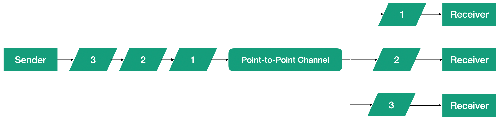

# Lesson 2: Point-to-point Channel.

The channel transmits the message from the sender to the recipient. With the point-to-point channel, you can only send a message to one recipient. We have used this type of channel in all the previous examples in this tutorial, so here we will just recall some important aspects to highlight the differences between the two types of channels.

In the previous examples, the sender knew the next stage of message processing and could choose a channel. Sometimes the sender has only one channel available, as in the movie counting pipeline example, where the sender had only one PID link to send the message after processing. But in other cases, like in the example of a road camera, the actor has multiple channels and decides which channel to use to send the message. That is, the link between the actors is of a static nature.

Another feature of this type of channel is that messages are delivered to the recipient in the same order as they were sent. The point-to-point channel delivers the message to exactly one recipient, as shown in the figure.

A point-to-point channel can have multiple recipients, but even so, each message is delivered to only one recipient. An example of such a channel is a cyclic router. Messages can be processed competitively by different recipients, but only one recipient will receive each specific message. This channel organization is shown in the figure.

The channel has several recipients, but each message is delivered to only one of them. Channels of this type are used when the connections between senders and recipients are static - the sender knows which channel to use to send a message to one or another recipient.

Channels of this type are most often used in Proto.Actor, because actually PID is a point-to-point channel implementation. All messages sent are delivered to the one actor and in the same order as they were sent.

