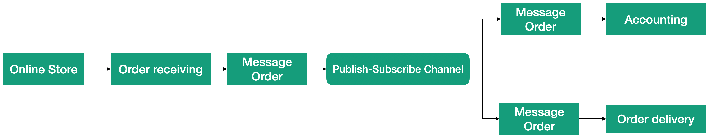
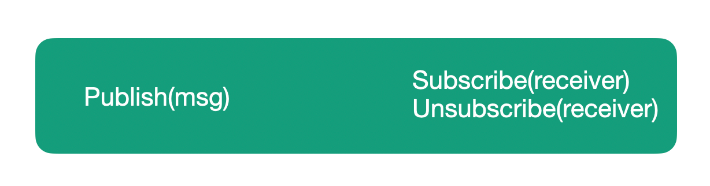

# Lesson 3: Publisher/Subscriber Channel.

Point-to-point channels deliver each message to only one recipient, as described in the previous lesson. Using this type of channels, the sender knows the recipient. But sometimes the sender may not know who is interested in his messages. This is the biggest difference between "publisher/subscriber" and "point-to-point" channels. Thus, the channel takes on the responsibility of following the recipients interested in the messages removes this responsibility from the sender. Publisher/Subscriber channel can also deliver a single message to multiple recipients.

Let's say we have an online store app. In the first step, the app accepts the order. After that, the system must pass the order to the next stage - the stage of delivery of the order (for example, a book) to the customer. The order acceptance stage sends a message to the order delivery stage. But to account for items in the warehouse, we also need to send an order to the accounting component. Thus еhe received order must be sent to two components of the system, as shown in the picture.

As a promotional, we have decided to make clients a little gift when they buy books. To do this, we will add a gift sending component to the system, which also needs to send a message with the order. Each time a new subsystem is added, we must change the first step to add sending messages to additional recipients. The publisher/subscriber channel will help us get rid of this problem. This channel can send the same message to multiple recipients without requiring the sender to know anything about the recipients. The figure shows how a published message is forwarded to the delivery and accounting subsystems.

When we need to add the ability to send gifts, we will simply subscribe to this component to receive messages, and we will not have to change anything in the ordering component. Another advantage of this type of channels is that the number and composition of recipients may change during operation. For example, gifts may not always be sent, but only on promotional days. Using this channel, we will add the gift component to the number of subscribers to the channel only during specific periods and exclude from subscribers after the end of the campaign, as shown in the picture.

If the receiver is interested in receiving the message from the publisher, it subscribes to the channel. When the publisher sends a message, the channel guarantees its delivery to all subscribers. When the promotion campaign ends, the gift component no longer requires order messages, so it unsubscribes from the channel. As a result, the channel methods can be divided into two categories according to their usage. The first category includes methods used by the sender to publish messages. The second category includes the methods used by the receiver to control the subscription. The picture below shows these two categories of methods.

Since recipients can subscribe to themselves to receive messages from the channel by themselves, this solution has a lot of flexibility. A publisher doesn't need to know how many subscribers they have. It may even happen that at some point, it will not have a single subscriber.

