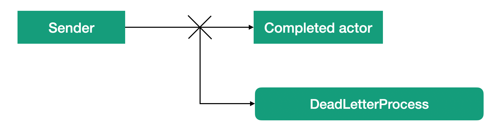

# Lesson 5: DeadLetter Channel.

DeadLetter is a channel for undelivered messages. It stores all messages that have not been processed or delivered. This is the most common channel, but most often, it is not used to send messages. Only when it is detected, a problem with a message. For example, if message cannot be delivered, will the message be automatically placed into DeadLetter channel.



By monitoring this channel, you can find out which messages have not been processed and take appropriate action. In particular, by testing the system using this channel you can find out why some messages have not been processed. If the system should not simply reset any messages, this channel can be used to resend messages after the problem has been resolved.

EventStream is used in Proto.Actor to implement a queue of undelivered messages. When a message is delivered to the mailbox of an already completed actor or sent after the message has been completed, the message arrives in the EventStream of the ActorSystem. The message is wrapped in a DeadLetterEvent class that contains the original message, the sender's address, and the receiver's address. That is, the queue of undelivered messages is integrated into the common EventStream queue. To receive undelivered messages, it's enough to subscribe the actor to receive messages of `DeadLetterEvent()` type from EventStream. An example with a subscription to a certain type of messages as described in the previous lesson.

Let's see at a little example. Let's create a simple actor called Echo that returns any messages back to the sender, and after it's started, we'll immediately send it a PoisonPill message. This will cause immediate shutdown of an actor work. You can see from the listing that the message can be received by subscribing to receive messages like `DeadLetterEvent()`.

```c#
static async Task Main(string[] args)
{
    var system = new ActorSystem();
    var props = Props.FromProducer(() => new Echo());
    var pid = system.Root.Spawn(props);

    system.EventStream.Subscribe<DeadLetterEvent>(msg => Console.WriteLine($"Sender: {msg.Sender}, Pid: {msg.Pid}, Message: {msg.Message}"));

    system.Root.Send(pid, new TestMessage());
    await system.Root.PoisonAsync(pid);
    system.Root.Send(pid, new TestMessage());

    Console.ReadLine();
}
```

Messages sent to a terminated actor cannot be processed and the pid on that actor must no longer be used. When messages are sent to a terminated actor, they are placed in the DeadLetter queue. This confirms receipt of the message by our handler.

```c#
system.EventStream.Subscribe<DeadLetterEvent>(msg => Console.WriteLine($"Sender: {msg.Sender}, Pid: {msg.Pid}, Message: {msg.Message}"));
```

The DeadLetter queue can also be used to store messages that have not been processed. But the decision about it is made at the level of each specific actor. The actor can determine that it cannot process the received message and does not know what to do with it. In this situation, the message can be sent to the undelivered message queue. The ActorSystem  has a link to the DeadLetter actor. When there is a need to send a message to the undelivered message queue, it can be passed to this actor:

```c#
System.DeadLetter.SendUserMessage(Self, msg);
```

