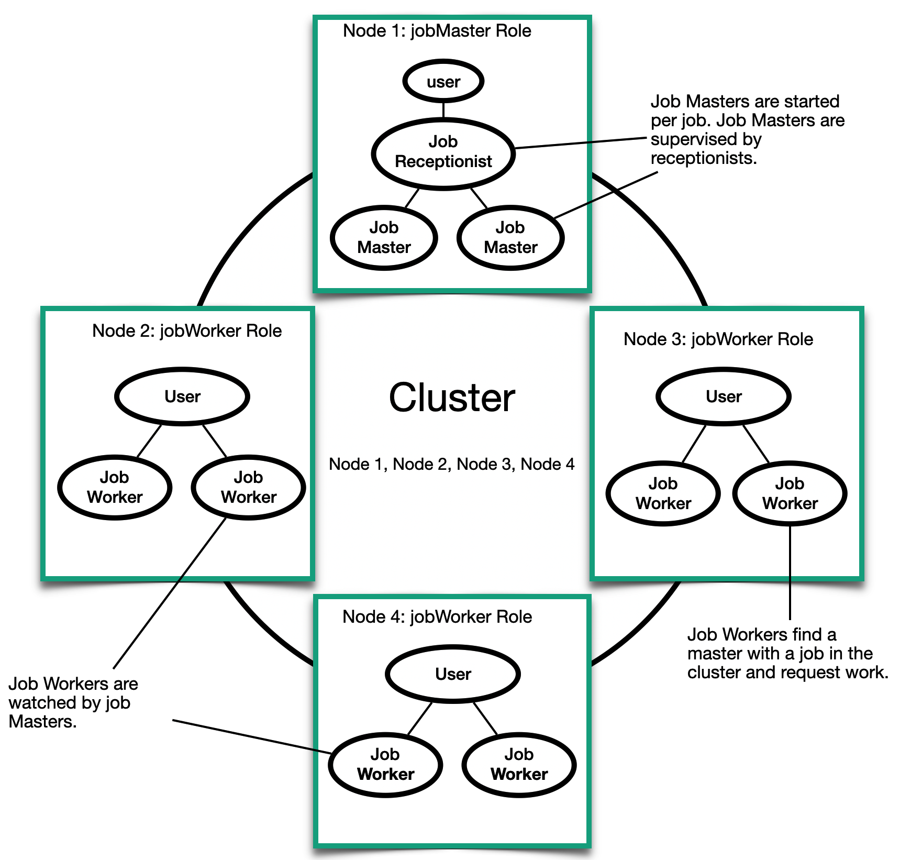

# Lesson 1:  Why do you need clusters?

A cluster is a dynamic group of nodes. Each node has its own actor system that accepts requests from the network (as described in chapter 7). Clusters are constructed based on the Proto.Cluster module and help to raise the transparency of actors' location to a new level. An actor can exist on a local or remote system and be anywhere in the cluster; you don't have to worry about where it is in your code. The picture shows a cluster with four nodes.

The end goal of the Proto.Cluster module is to provide a fully automated way to distribute actors, load balancing, and maintain fault tolerance. Currently, the Proto.Cluster module supports the following functions:

- cluster membership - reliable membership for actor systems.
- load balancing - routing messages in the cluster based on a specialized algorithm.
- point separation - the actor system can be divided into subtrees of actors located at different nodes.

In this lesson, we will look at all these functions in detail, focusing on cluster membership and routing. We will then discuss state replication mechanisms and automatic Fault Tolerance support.

The data processing application for a single purpose is an excellent example of a candidate to create a cluster. These include image recognition or analysis of social networks in real-time. Nodes in such applications can be added or removed as the load on the application increases or decreases. Tasks that perform processing are monitored, and if the actor fails, the task is restarted, and the attempts are repeated until the processing succeeds. In this module, we will consider a simple example of an application of this type. The figure shows its overall structure; 

Don't pay much attention to the details yet, as they will all be discussed in detail throughout the module.

And now let's move on to the implementation of our clustered word count application. In the next lesson, we will go deeper into the details of cluster membership and see how the lead and slave actors can find each other and collaborate to complete tasks.