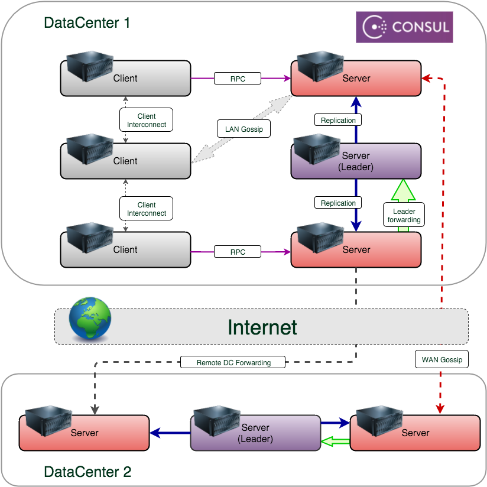
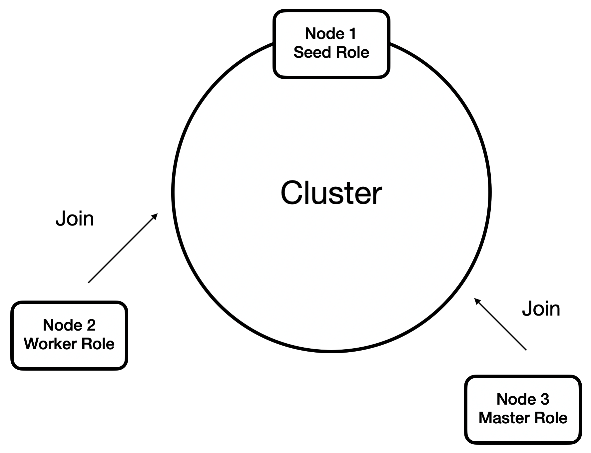

# Lesson 3:  Joining to the cluster.

Currently, the Proto.Actor platform supports two major providers for clustering. 

The first of them and the most preferable for creating large clusters. It is a provider based on platform **Consul** ([http://consul.io](https://consul.io/)). **Consul** is a discovery service. Discovery service is a tool to provide communication between architecture components. Discovery can be seen as some distributed architecture metainformation registry that stores all data about the components. This allows us to realize the interaction of components with minimal manual intervention.

#### The role of Discovery services in the process of building a distributed architecture

Discovery service provides three main functions, within a distributed architecture:

- Consistency of metainformation about services in the cluster.
- Mechanism for registering and monitoring component availability.
- Mechanism for component discovery.

Explain the values of each item in detail:

*Data Consistency*
Distributed architecture means that components can be scaled horizontally, and they must have the actual information about the state of the cluster. Discovery service provides decentralized storage and access to it for any node. Components can store their data and the information will be delivered to all interested cluster members.

*Registrations and monitoring*
Newly added services must be reported and those already running must be checked continuously for availability. This is a prerequisite for automatic cluster configuration.  Traffic balancer and dependent nodes must have information about the current cluster configuration for efficient resource utilization.

*Сomponent discovery*
By discovery, we mean the mechanism of searching services, for example, by the roles they perform. We can request a location for all services of a particular role, not knowing their exact number and specific addresses, but only knowing the address of the discovery service.

#### Consul.io as a discovery implementation

Consul is a decentralized fault-tolerant service from HashiCorp (which develops products such as Vagrant, TerraForm, Otto, Atlas, and others).

Consul is a decentralized service, that is, Consul agent is installed on each host and is a full member of the cluster. Thus, the services do not need to know the discovery address in our network; all requests for discovery are executed on the local address 127.0.0.1.

##### What else do you need to know about Consul:

For information distribution it uses algorithms that are based on the [eventual consistency](https://en.wikipedia.org/wiki/Eventual_consistency) model. Agents use the [gossip](https://en.wikipedia.org/wiki/Gossip_protocol) protocol to distribute information.
Servers for leader selection use [Raft algorithm](https://raft.github.io/). A leader is a server that accepts all requests to change information. If we draw an analogy with a database, it is a master in the context of master/slave - replication. All the other servers replicate the data from the leader. The key difference from the database replication is that in case of a leader failure, all the other servers launch the mechanism of selecting a new leader and automatically start replicating from it. The switching mechanism is fully automatic and does not require any administrator's intervention. Each instance can operate in two modes: agent and server. The difference is that the agent is the distribution point, and the server is the registration point. Agents accept read-only requests, and the server can make changes to already existing information (registering and removing services). We are in any case requesting a local address, the only difference is that the agent will process the read-only request on the localhost, and the data change request will be forwarded to the leader who will save and distribute the data throughout the cluster. If our local agent is not the leader, then our change request will be fully processed locally and distributed across the cluster.

#### Using Consul in cluster

A Consul cluster is a network of connected nodes that run services registered in the cluster. Consul ensures that information about the cluster will be distributed to all cluster members and is available on request. It also supports not only a peer-to-peer cluster but also a multi-peer cluster divided into zones, which are called DataCenters in the Consul terminology. With the help of Consul, you can work with a particular data center and perform actions on any other. Datacenters are not isolated from each other within a cluster. An agent in one data center can get information from another data center, which can help build an effective distributed system.

Consul agents running in server mode and their main role, also get the role of a potential cluster leader. It is recommended to use at least three agents in server mode in the cluster to provide fault tolerance. The use of server mode does not impose any restrictions on the main functionality of the agent.

In addition to **Proto.Cluster.Consul** in Proto.Actor platform there is a second provider called **Proto.Cluster.SingleRemoteInstance**.  Unlike **Proto.Cluster.Consul**, in **Proto.Cluster.SingleRemoteInstance** you need to create a reference node to start the cluster. The reference node is actually the initial point of growth of the cluster and serves as the first instance for making contacts with other nodes. The nodes join the cluster by sending a message containing the unique address of the node to be connected. The anchor node is not required to contain any custom actors, so it is possible to create anchor nodes that are solely responsible for maintaining the cluster. The figure shows how the first anchor node initializes the cluster and how the other anchor nodes then join the cluster.

Unlike **Proto.Cluster.Consul** **Proto.Cluster.SingleRemoteInstance** does not support automatic node detection protocol, so it needs to explicitly specify the host name and port number of the reference node to join. 

After we learned the basic theoretical concepts, let's try to create our first cluster based on **Proto.Cluster.SingleRemoteInstance**.

