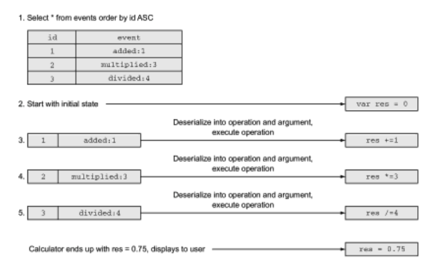

# Lesson 1: What is Event Sourcing.

The Event Sourcing technology (event history) appeared quite a long time ago. We will look at a simple example that demonstrates the difference between storing event history and simple records with status information. In this example, we implement a calculator that should only remember the last calculated result.

#### Updating records.

Updating records is the simplest method used when using database SQL for operational processing transactions (Online Transaction Processing, OLTP). Picture 1 shows how you can use SQL instructions insert and update to save the calculation results in the calculator.

The calculator inserts one record; the search instruction for an already existing record is omitted for ease of reference. All calculations are performed directly in the database, using the update instruction to modify the table entry. Each update instruction is executed in a different transaction.

In picture 1, you can see that the calculator displays the result 0.75. After restarting, the application asks for the result, as shown in picture 2.

It's quite simple; the record stores only the last calculated result. However, in this example, there is no way to determine how the user got to the O.75 result, and what intermediate results occurred after the end of the calculation? (We do not take into account that it is theoretically possible to observe some intermediate results in SQL queries running in parallel with the update instructions at a low level of isolation).

If you want to know what calculations the user performed, you will have to save them in a separate table. All calculations are performed within SQL instructions. Each subsequent calculation depends on the previous result stored in the record.

#### Saving the state without changes

The idea of Event Sourcing technology (history of events) is described below. Instead of storing the last result in a single record, all successfully performed operations can be logged as events. The event must describe exactly what is happening; in this case we will store the name of the operation and its argument. Again, the example uses simple SQL instructions; the log is organized as a simple table in a database. In the Fig. 3 shows the instructions, remembering the entire history of calculations.

Calculations are performed in the memory; the event is saved after a successful operation. The ID column uses the sequence mechanism in the database, and its value is automatically increased by one in each new record. (You may assume that the insertion of each record is performed in its own transaction or the automatic confirmation function is used.)

Events describe operations that have been successfully performed since the initial state. A simple variable is used to store the result. Each event is converted into a string containing the event name and argument, separated by a colon.

Now let's see how a calculator reconstructs the last known state based on an event. Initially, the calculator is initialized with the O value and then sequentially performs all stored operations in the same order. The application reads the events, converts them into operations, performs these operations, and eventually gets the value of 0.75, as shown in the picture. 4.

As you can see, Event Sourcing is a simple technology. In the next section, we will see how this technology can be used to save the actor state.

#### Which solution is "easier"?

The CRUD style solution is perfect for a simple calculator. It requires less storage space, and restoring the last result is easier. We used the calculator application only to highlight the differences between the two approaches. The publicly available variable state is our enemy. Saving it in a database does not solve the problem. Interactions with the database are becoming more and more complicated when using CRUD operations without control—the combination of actors and the Proto.Persistence module provides an easy way to implement Event Sourcing technology without requiring a lot of effort from the programmer, as you will see later in this module.

#### Event Sourcing for actors

One of the most significant advantages of Event Sourcing (history of events) is the separation of write and read operations with the database in two stages. Reading from the journal occurs only when the state of the stored actor is restored. After recovery, the actor continues to act as usual: processes messages and stores its state in memory, simultaneously storing the events in permanent storage.

The journal has a simple interface. If you do not go into details, it should only support the addition of serialized events, as well as reading the deserialized event from a specific place in the journal. Events in the journal are actually unchanged - they cannot be changed after writing to the table. Once again, it should be noted that invariability is preferable to variability when it comes to the difficulties of organizing parallel access to data.

The Proto.Persistence module defines a journal interface that allows anyone to write their implementation.

Event Sourcing also has its shortcomings. The most obvious of them is increased storage space consumption. To get the last known state, all events that happened from the initial moment must be restored after the disaster, and each state change must be applied, which can take a lot of time.

Creating snapshots of the actor state, which we will discuss later in this section, can reduce the storage space requirement and increase state recovery speed. This technique allows you to skip many events and only process those that have happened since the last snapshot.

It is safe to say that Event Sourcing technology requires some form of event serialization. In some cases, serialization can be done automatically; in others, you will have to write the necessary code yourself. Imagine that you've changed the event in your application (renamed a field, for example, or added a new field) - then how to deserialize the old and new versions of the event from the serialized data journal is a complex task; we'll discuss solutions to this problem later in this course.

In reality, Event Sourcing only provides a way to restore state from events; it does not solve the problem of creating specialized queries. A well-known area of application for specialized queries is event replication to a system optimized for analysis.

In the next part, we will begin to design the calculator to lay the basis for further discussion.