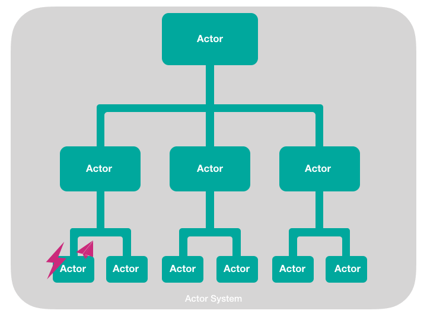

# Урок 10: Обзор иерархии супервизора в Proto.Actor.

Одним из важнейших аспектов Proto.Actor является способность акторов наблюдать за другими акторами, ранее мы видели, что у актора может быть несколько дочерних акторов. Если у актора есть дочерние акторы, родительский актор обязан наблюдать за состоянием дочерних акторов. 

Таким образом, формируется иерархия акторов. У нас есть родительские акторы, которые наблюдают за дочерними акторами. У дочерних акторов также могут быть свои собственные дети и так далее по всей иерархии. Такая иерархия акторов позволяет создавать отказоустойчивые системы, а также позволяет системе самовостанавливаться. 

Самовосстановление - это особенность системы, которая позволяет определить, что возникла проблема, и автоматически исправить её, не прибегая к помощи внешнего мира или системного администратора. 

К примеру, если у актора произойдёт сбой, его родительские акторы будут оповещены об этом, и тогда родительский актор должен решить, как обработать эту ошибку с дочерним актором. 

Существует несколько различных стратегий, которые родительский акторы могут использовать для того чтобы справиться со сбоем в дочернем акторе. 

Одна из стратегий заключается в том, чтобы перезапустить актор из его начального состояния. Могут возникать ситуации, когда родительский актор не знает, что делать, и не может исправить ошибку дочернего актора. В этом случае родительский актор может отправить сообщение своему родительскому актору, что он не знает, что делать с ошибкой от дочернего актора нижнего уровня, и просит родителя помочь ему справиться с проблемой. 

Одна из ключевых концепций иерархии наблюдения за акторами заключается в том, что мы можем передать более рискованную или склонную к ошибкам работу нижнему уровню иерархии, чтобы дочерние акторы в нижнем уровне иерархии выполняли всю рискованную работу. 

Если эта рискованная работа, вызывает какую либо ошибку, то она повлияет только на этого актора. Родительские акторы этого актора не будут затронуты и не потеряют своё внутренне состояние, если их дочерние акторы потерпят неудачу.

Иерархия супервизора позволяют системе не только справляться с ошибками, но и самовостановиться. 