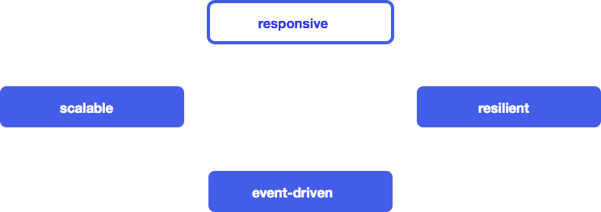

# Урок 4: Манифест реактивного программирования.

Proto.Actor придерживается принципов, впервые высказанных в манифесте реактивного программирования. Манифест реактивного программирования — это набор принципов для создания гибких, слабосвязанных и масштабируемые систем. Такие системы просты в разработке, и они поддаются изменениям. Они менее чувствительны к сбоям и реагируют на сбои элегантно.

В последние годы требования к приложениям значительно изменились. Десятки серверов, время отклика в несколько секунд, офлайновое обслуживание, которое могло длиться часами, гигабайты данных — такими были большие приложения буквально несколько лет назад. Сегодня же приложения работают абсолютно на всём, начиная с простых мобильников и заканчивая кластерами из тысячи процессоров. Пользователи ожидают миллисекундного времени отклика и стопроцентного аптайма, в то время как данные выросли до петабайтов.

Первоначально эту нишу занимали крупные инновационные интернет-компании типа Google или Twitter, однако такие требования к приложениям начали всплывать во многих областях индустрии. Финансовые и телекоммуникационные компании первыми начали внедрять новые практики, чтобы удовлетворить новым требованиям, а теперь подтягиваются и остальные.

Новые требования требуют новых технологий. Предыдущие решения делали упор на управляемые сервера и контейнеры. Масштабирование достигалось засчёт покупки более крутых серверов и использования многопоточности. Для добавления новых серверов приходилось применять комплексные, неэффективные и дорогие проприетарные решения.

Однако прогресс не стоит на месте. Архитектура приложений эволюционировала в соответствии с изменившимися требованиями. Приложения, разработанные на основе этой архитектуры, мы называем *Реактивными Приложениями*. Такая архитектура позволяет программистам создавать *событийно-ориентированные, масштабируемые, отказоустойчивые и отзывчивые* приложения — приложения, работающие в реальном времени и обеспечивающие хорошее время реакции, основанные на масштабируемом и отказоустойчивом стеке и которые легко развернуть на многоядерных и облачных архитектурах. Эти особенности критически важны для реактивности.

## Реактивные приложения

Словарь Merriam Webster даёт определение реактивному как *«готовому реагировать на внешние события»*, что означает что компоненты всё время активны и всегда готовы получать сообщения. Это определение раскрывает суть реактивных приложений, фокусируясь на системах, которые:

- *реагируют на события*
  Ориентированность на события означает наличие следующих качеств
- *реагируют на повышение нагрузки*
  Фокус на масштабируемость, конкурентный доступ к общедоступным ресурсам сводится к минимуму
- *реагируют на сбои*
  Строятся отказоустойчивые системы с возможностью восстанавливаться на всех уровнях
- *реагируют на пользователей*
  Гарантированное время отклика, не зависящее от нагрузки

Каждая из этих характеристик существенна для реактивного приложения. Все они зависят друг от друга, но не как ярусы стандартной многоуровневой архитектуры. Напротив, они описывают свойства, применимые на всём стеке технологий:

Далее мы более подробно рассмотрим каждую из этих четырёх характеристик и увидим, как они соотносятся друг с другом.

## Ориентированность на события

### Почему это важно

Приложения, использующие асинхронную модель, намного лучше обеспечивают *слабую связанность*, чем приложения, базирующиеся на чисто синхронных вызовах. Отправитель и получатель могут быть реализованы, не оглядываясь на детали того, как события распространяются в системе, что позволяет интерфейсам фокусироваться на содержимом передачи. Это приводит к реализации, которую легче расширять, изменять и поддерживать, обеспечивает большую гибкость и уменьшает стоимость поддержки.

Так как получатели асинхронного взаимодействия бездействуют, пока не получат сообщение, то такой подход может позволить эффективно использовать ресурсы, делая возможным большому количеству получателей работать в одном и том же аппаратном потоке. Таким образом, неблокирующее приложение может иметь *более низкую латентность* и *бóльшую пропускную способность* по сравнению с традиционным приложением, основанном на блокирующей синхронизации и примитивах коммуникации. Это приводит к уменьшению стоимости операций, увеличению утилизации ресурсов процессора и делает конечных пользователей счастливее.

### Ключевые строительные блоки

В событийно-ориентированном приложении компоненты взаимодействуют друг с другом путём отправки и получения *сообщений* — дискретных частей информации, описывающих факты. Эти сообщения отправляются и принимаются в асинхронном и неблокирующем режиме. Событийно-ориентированные системы более склонны к *push*-модели, нежели чем к *pull* или *poll*. Т.е. они проталкивают данные к своим потребителям, когда данные становятся доступными, вместо того чтобы впустую тратить ресурсы, постоянно запрашивая или ожидая данные.

- Асинхронная передача сообщений означает, что приложение по своей природе обладает высокой степенью конкуренции и может без изменений работать на многоядерной архитектуре. Любое ядро CPU может обработать любое сообщение, что даёт бóльшие возможности параллелизации.
- Неблокирование означает способность продолжать работать, чтобы приложение было *отзывчивым* всё время, даже в условиях сбоя или пиковой нагрузки. Для этого все необходимые для обеспечения отзывчивости ресурсы, например CPU, память и сеть, не должно быть монополизированы. Это приведёт к более низкой латентности, большей пропускной способности и лучшей *масштабируемости*.

Традиционные серверные архитектуры используют общедоступное изменяемое состояние и блокирующие операции на одном потоке. Это вносит трудности при масштабировании системы. Общедоступное изменяемое состояние требует синхронизации, что привносит сложность и недетерменированность, делая код трудным для понимания и сопровождения. Переключение потока в спящий режим расходует ограниченные ресурсы, а пробуждение стоит дорого.

Разделяя генерацию событий и их обработку, мы позволяем платформе самой позаботиться о деталях синхронизации и диспетчеризации событий между потоками, в то время как мы сами концентрируемся на более высокоуровневых абстракциях и бизнес-логике. Мы думаем о том, откуда и куда пересылаются события, и о том, как компоненты взаимодействуют между собой, вместо того чтобы копаться с низкоуровневыми примитивами вроде потоков или блокировок.

Событийно-ориентированные системы обеспечивают слабую связанность между компонентами и подсистемами. Такая связанность, как мы увидим позже, является одним из необходимых условий масштабируемости и отказоустойчивости. Без сложных и сильных зависимостей между компонентами расширение системы требует минимальных усилий.

Когда от приложения требуется высокая производительность и хорошая масштабируемость, трудно предусмотреть, где могут возникнуть узкие места. Поэтому очень важно, чтобы всё решение было асинхронным и неблокирующим. Для типичного приложения это означает, что архитектура должна быть полностью событийно-ориентированной, начиная с запросов пользователей через графический интерфейс (браузер, REST и т.п.) и обработки запросов в веб-слое и заканчивая сервисами, кэшем и базой данных. Если хотя бы один из этих слоёв не будет отвечать этому требованию — будет делать блокирующие запросы в БД, использовать общедоступное изменяемое состояние, вызывать дорогие синхронные операции — то весь стек заглохнет и пользователи будут страдать из-за возросших задержек и упавшей масштабируемости.

Приложение должно быть *реактивным сверху донизу*.

Необходимость устранять слабое звено в цепи хорошо иллюстрируется [законом Амдала](http://ru.wikipedia.org/wiki/Закон_Амдала), который согласно Википедии гласит:

*Ускорение программы засчет её распараллеливания ограничивается последовательной частью программы. Например, если 95% объёма вычислений может быть распараллелено, то теоретический максимум ускорения не может превысить 20, в независимости от количество использованных процессоров.*

## Масштабируемость

### Почему это важно

Слово масштабируемый определяется словарём Merriam Webster как *«способный легко расшириться или модернизироваться»*. Масштабируемое приложение может быть расширено до необходимых масштабов. Это достигается засчёт придания приложению эластичности, свойства, которое позволяет системе растягиваться или сжиматься (добавлять или убирать узлы) по требованию. Кроме того, такая архитектура делает возможным расширяться или сокращаться (разворачиваться на большем или меньшем количестве процессоров) без необходимости перепроектирования или переписывания приложения. Эластичность минимизирует цену функционирования в облаке, в то время как мы платим только за то, что действительно используем.

Масштабируемость также помогает управлять рисками: слишком малое количество оборудования может привести к неудовлетворению и потере клиентов, а слишком большое будет попросту бездействовать (вместе с персоналом) и приведёт к лишним расходам. Ещё масштабируемое приложение снижает риск ситуации, когда доступно оборудование, но приложение не может его использовать: в ближайшие 10 лет мы будем иметь процессоры с сотнями, если не с тысячами аппаратных потоков, и использование их потенциала требует масштабируемости на микроскопическом уровне.

### Ключевые строительные блоки

Событийно-ориентированная система, базирующаяся на асинхронной передаче сообщений, является основой масштабируемости. Слабая связанность и локационная независимость компонентов и подсистем позволяют разворачивать систему на множестве узлов, оставаясь в пределах той же самой программной модели с той же семантикой. При добавлении новых узлов возрастает пропускная способность системы. В терминах реализации не должно быть никакой разницы между развертыванием системы на большем количестве ядер или большем количестве узлов кластера или центра обработки данных. Топология приложения становится проблемой конфигурации и/или адаптивных алгоритмов времени выполнения, следящих за нагрузкой на систему. Это то, что мы называем [локационной прозрачностью](http://en.wikipedia.org/wiki/Location_transparency).

Важно понимать, что цель — не изобрести прозрачные распределённые вычисления, распределённые объекты или RPC-коммуникации — это уже пытались сделать раньше и эта затея провалилась. Вместо этого мы должны *охватить сеть*, представив её прямым образом в программной модели через механизм асинхронных сообщений. Настоящая масштабируемость естественным образом полагается на распределённые вычисления и их межузловое взаимодействие, что означает обход сети, который по своей сути [является ненадёжным](http://aphyr.com/posts/288-the-network-is-reliable). Поэтому важно учесть ограничения, компромиссы и сценарии исключительных ситуаций явно в программной модели вместо того, чтобы прятать их за ширмой дырявых абстракций, которые якобы пытаются «упростить» вещи. Как следствие, в равной степени важно обеспечить себя программными инструментами, содержащими в себе строительные блоки для решения типичных проблем, которые могут возникнуть в распределённом окружении — вроде механизмов для достижения консенсуса или интерфейсов обмена сообщениями, которые обладают высоким уровнем надёжности.

## Отказоустойчивость

### Почему это важно

Отказ приложения — одна из самых разрушительных вещей, которые могут произойти с бизнесом. Обычно это приводит к тому, что работа сервиса просто прекращается, оставляя брешь в потоке прибыли. В долгосрочной перспективе это может привести к неудовлетворённости клиентов и плохой репутации, что навредит бизнесу ещё серьёзней. Удивительно, что требование отказоустойчивости приложений повсеместно игнорируется или решается ad-hoc техниками. Это часто означает, что проблему рассматривают не на том уровне детализации с использованием слишком неточных и грубых инструментов. Распространённое решение — применение кластеризации сервера приложений с восстановлением при сбоях во время работы. К сожалению, подобные готовые решения чрезвычайно дороги и, кроме того, опасны — они потенциально могут каскадным образом «уронить» весь кластер. Причина в том, что проблема управления сбоями решается на карте слишком малого масштаба, хотя должна прорабатываться детально на уровне взаимодействия более мелких компонентов.

В реактивном приложении отказоустойчивость не оставляется «на потом», а является частью архитектуры с самого начала. Отношение к сбоям как к объектам первого класса в программной модели облегчит задачу реагирования на них и управления ими, что сделает приложение толерантным к сбоям и позволит системе «лечить» и «чинить» саму себя в процессе работы. Традиционные способы обработки исключительных ситуаций не могут достигнуть этого, потому что проблемы решаются не на тех уровнях — мы либо обрабатываем исключения прямо там, где они происходят, либо инициируем процедуру восстановления всего приложения.

### Ключевые строительные блоки

Чтобы управлять сбоями, нам нужен способ изолировать их, так чтобы они не распространялись на другие работоспособные компоненты, и вести за ними наблюдение из безопасного места вне контекста, в котором могут происходить сбои. Один способ, который приходит на ум, — это переборки, разделяющие систему на отсеки таким образом, что если затапливается один из отсеков (выходит из строя), то это никак не влияет на другие отсеки. Это предотвращает классическую проблему каскадных сбоев и позволяет решать проблемы изолированно.

Событийно-ориентированная модель, которая даёт масштабируемость, также предоставляет необходимые примитивы для решения проблемы отказоустойчивости. Слабая связанность в событийно-ориентированной модели снабжает нас полностью изолированными компонентами, в которых сбои инкапсулируются в сообщения вместе с необходимыми деталями и пересылаются другим компонентам, которые в свою очередь анализируют ошибки и решают, как реагировать на них.

Такой подход создаёт систему, в которой:

- бизнес-логика остаётся чистой, отделённой от обработки ошибок;
- сбои моделируются явно, чтобы разбиение на отсеки, наблюдение, управление и конфигурация задавались декларативно;
- система может «лечить» себя и восстанавливаться автоматически.

Лучше всего, если отсеки организуются иерархическим образом, подобно большой корпорации, где проблемы поднимаются до уровня, имеющего достаточно власти, чтобы принять соответствующие меры.

Мощь данной модели в том, что она чисто событийно-ориентированная — она основана на реактивных компонентах и асинхронных событиях, и поэтому обладает *локационной прозрачностью*. На практике это означает, что её семантика не зависит от того, работает ли она на локальном сервере или в распределённом окружении.

## Отзывчивость

### Почему это важно

Отзывчивый определяется словарём Merriam-Webster как *«отвечающий быстро или реагирующий надлежащим образом»*. Отметим, что далее мы будем использовать это слово в его общем смысле и не будем путать с [отзывчивым веб-дизайном](http://en.wikipedia.org/wiki/Responsive_Web_Design) с его CSS [медиа-запросами](http://en.wikipedia.org/wiki/Media_queries) и [прогрессивными улучшениями](http://en.wikipedia.org/wiki/Progressive_enhancement).

Отзывчивые приложения — это приложения реального времени, они привлекательны, насыщены функционалом и предоставляют совместный доступ. С клиентами поддерживается открытый и непрерывный диалог через отзывчивость и интерактивность. Это делает работу клиентов более продуктивной, создаёт чувство постоянства и готовности в любой момент решить проблемы и выполнить задачи. Одним из таких примеров являются Документы Google, которые поддерживают функцию совместного редактирования в режиме реального времени, что позволяет пользователям непосредственно видеть правки друг друга.

Приложения должны своевременно реагировать на события, даже в условиях сбоя. Если приложение не отвечает в пределах разумного промежутка времени (также именуемого латентностью), то по факту оно недоступно и поэтому его нельзя считать *отказоустойчивым*.

Неспособность оставаться в жестких рамках реального времени для некоторых приложений, например, связанных с оружием или медициной, равносильна полному отказу системы. Не все приложения имеют такие строгие требования. Многие приложения быстро становятся бесполезными, если они перестают отвечать временным требованиям, например, приложение, осуществляющее торговые операции, может потерять текущую сделку, если не успеет ответить вовремя.

Более общераспространённые приложения, такие как онлайн-магазины розничных покупок, теряют прибыль, если время отклика увеличивается. Пользователи интенсивнее взаимодействуют с *отзывчивыми* приложениями, что приводит к большим объёмам покупок.

### Ключевые строительные блоки

Реактивные приложения используют наблюдаемые модели, потоки событий и клиенты с состоянием.

Наблюдаемые модели позволяют другим системам получать события, когда их состояние изменяется. Это обеспечивает связь в реальном времени между пользователями и системами. Например, когда несколько пользователей работают одновременно над одной и той же моделью, изменения могут реактивно синхронизироваться между ними, избавляя от необходимости блокировки модели.

Потоки событий образуют базовую абстракцию, на которой строятся такие связи. Сохраняя их реактивными, мы избегаем блокировок и позволяем преобразованиям и коммуникациям быть асинхронными и неблокирующими.

Реактивные приложения должны иметь знание о [порядках алгоритмов](http://ru.wikipedia.org/wiki/«O»_большое_и_«o»_малое), чтобы быть уверенным, что время отклика на события не превышает O(1) или, как минимум, O(log n) независимо от нагрузки. Может быть включён коэффициент масштабирования, но он не должен зависеть от количества клиентов, сессий, продуктов или сделок.

Вот несколько стратегий, которые помогут сохранить латентность независимой от профиля нагрузки:

- В случае взрывного трафика реактивные приложения должны амортизировать затраты на дорогие операции, такие как ввод-вывод или конкурентный обмен данными, применяя batching с пониманием и учитыванием специфики низлежащих ресурсов.
- Очереди должны быть ограничены с учётом интенсивности потока, длины очередей при данных требованиях на время отклика должны определяться согласно [закону Литтла](http://en.wikipedia.org/wiki/Little's_law).
- Системы должны находиться в состоянии постоянного мониторинга и иметь адекватный запас прочности.
- В случае сбоев активируются [автоматические выключатели](http://en.wikipedia.org/wiki/Circuit_breaker_design_pattern) и запускаются запасные стратегии обработки.

В качестве примера рассмотрим отзывчивое веб-приложение с «богатыми» клиентами (браузер, мобильное приложение), чтобы предоставить пользователю качественный опыт взаимодействия. Это приложение исполняет логику и хранит состояние на стороне клиента, в котором наблюдаемые модели предоставляют механизм обновления пользовательского интерфейса при изменении данных в реальном времени. Технологии вроде WebSockets или Server-Sent Events позволяют пользовательскому интерфейсу соединяться напрямую с потоком событий, так что система целиком становится событийно-ориентированной, начиная с back-end слоя и заканчивая клиентом. Это позволяет реактивным приложениям проталкивать события браузеру и мобильным приложениям посредством асинхронной и неблокирующей передачи данных, сохраняя масштабируемость и отказоустойчивость.

Теперь становится понятным, каким образом четыре «кита» реактивности: *ориентированность на события*, *масштабируемость*, *отказоустойчивость* и *отзывчивость* — связаны друг с другом и образуют единое целое:

Реактивные приложения представляют собой сбалансированный подход для решения современных проблем в разработке программных систем. Они построены на каркасе, *ориентированном на события* и передаче сообщений, и обеспечивают инструменты для обеспечения *масштабируемости* и *отказоустойчивости*. Поверх этого они поддерживают насыщенные и *отзывчивые* интерфейсы взаимодействия с пользователем. Мы ждём, что системы, число которых стремительно растёт, в ближайшем будущем будут следовать этому манифесту.