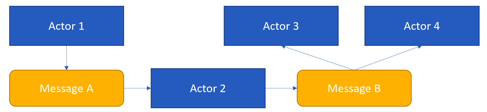

# Урок 6: Акторы и сообшения.

Прежде чем перейти к более детальному рассмотрению акторов и сообщений. Я бы хотел дать общий обзор того, как эти две концепции сочетаются друг с другом.

Акторы - это место, где фактически осуществляется работа всей нашей системы, поэтому именно в акторах мы пишем весь код нашей системы. Однако сам по себе один актор не может сделать многого, поэтому мы общаемся между акторами, используя сообщения.

Здесь первый актор создает экземпляр сообщения типа A, и передаёт его второму актору.

Затем второй актор осуществляет некоторую обработку, в результате которой он создаёт новое сообщение с типом B, и посылает это сообщение двум акторам, в данном случае, актору три и актору четыре. 

Здесь следует заметить, что отправка сообщения от одного актора к другому является асинхронной операцией, поэтому, как только актор один отправит сообщение типа A актору два, он сможет продолжить свою работу, тоесть ему не нужно ждать, пока актор два закончит обработку полученного сообщения. 

