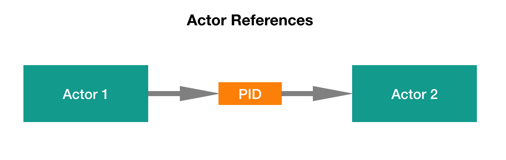
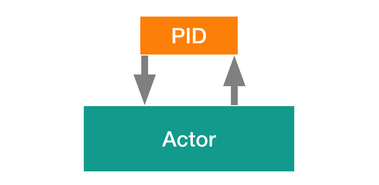

# Урок 2: Ссылки на актор.

В системе акторов не было бы смысла, если бы она не состояла из нескольких агентов, которые взаимодействуют друг с другом. Как мы знаем из первого модуля, акторы взаимодействуют между собой путём отправки сообщений. Поэтому чтобы иметь возможность отправить сообщение, одному актору нужна некая ссылка на другой актор. 

И так здесь мы видим, что актор 1 хочет отправить сообщение актору 2. В Proto.Actor мы не работаем с акторами на прямую, вместо этого мы работаем с PID интересующего нас актора. PID это идентификатор процесса Process ID. 

Каждый актор имеет уникальный идентификатор PID, позволяющий Proto.Actor различать акторы. Когда создаётся новый актор, Proto.Actor присваивает ему следующий свободный (т. е. не ассоциированный ни с каким актором) идентификатор. Присвоение идентификаторов происходит по возрастающий, т.е. идентификатор нового актора больше, чем идентификатор актора, созданного перед ним. Когда актор завершает свою работу, Proto.Actor освобождает занятый им идентификатор.

Таким образом, PID является слоем абстракции над актором. И имея этот уровень абстракции, мы можем фактически передавать ссылки на акторы по всей системе с помощью сообщений. Плюс к этому каждый актор имеет ряд специальных ссылок на акторы

Первая ссылка это ссылка на самого себя. Поскольку PID является абстракцией над актором. Мы можем использовать свой PID, чтобы отправить сообщение самому себе. К примеру, это может понадобиться, когда вы захотите отправить сообщение самому себе отложенное во времени.

Следующая специальная ссылка, которая есть у нашего актора, это ссылка на его дочерние акторы. К примеру, наш актор создал два дочерних актора. И вы можем использовать эти ссылки, для того чтобы остановить или перезапустить дочерние акторы.

И последняя, интересующая нас ссылка, это ссылка на родительский актор. То есть дочерние акторы имеет возможность общаться со своим родителем. К примеру, дочерний актор может оповестить родительский о том, что при обработке сообщения произошла ошибка.

Теперь вы знаете, что в Proto.Actor не используются прямые ссылки на другие акторы, вместо этого у нас есть абстракция над акторами в PID.

В Proto.Actor Основным способом получения PID актора является создание нового актора. То есть после создания дочернего или корневого актора Proto.Actor возвращает PID только что созданного актора. Этот PID можно использовать для отправки сообщений актору.

