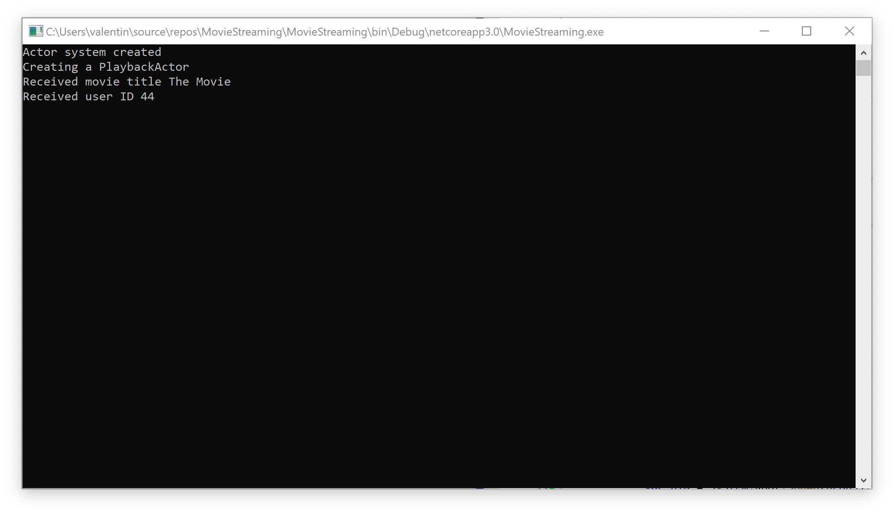

# Урок 6: Определение сообщений, которые будет обрабатывать актор.

В предыдущем уроке, мы с вами создали систему акторов, и экземпляр нашего актора внутри этой системы. В этом уроке, мы с вами рассмотрим, как отправлять и отвечать на сообщения в системе акторов.

Для этого мы модифицируем наш PlaybackActor, чтобы он мог отвечать на сообщения типа string и int. Далее мы будем использовать метод Send для того, что бы отправить сообщение нашему актору.

Итак, давайте перейдём в исходный код нашего приложения и посмотрим, как мы можем отправить пару сообщений нашему актору. Для этого нам понадобится ссылка на наш актор которую мы получили в предыдущем уроке и метод `Send` который предоставляет нам наша система акторов.

```c#
var pid = system.Root.Spawn(props);

system.Root.Send(pid, "The Movie");
system.Root.Send(pid, 44);
```

Как вы видите, мы только что отправили два сообщения нашему актору. Первое сообщение представляет собой строку содержащую название фильма, а второе сообщение содержит, цифровой идентификатор пользователя который представляет собой int. 

Если сейчас мы запустим наши приложения, то ничего не произойдёт. Поскольку метод `ReceiveAsync` актора `PlaybackActor` не содержит бизнес логики. 

Так что давайте перейдём в метод `ReceiveAsync` и реализуем обработку наших сообщений. Прежде всего, нам необходимо определить какой тип сообщение поступил к нам на обработку. Для этого нам нужно извлечь сообщение из свойства `context.Message` и передать его в оператор switch. 

Для выбора подходящей логики обработки сообщений. 

```c#
public Task ReceiveAsync(IContext context)
{
    switch (context.Message)
    {
        case string movieTitle:
            break;
        case int userId:
            break;
    }
    return Actor.Done;
}
```

Теперь давайте непосредственно реализуем бизнес логику. Наша бизнес логика будет очень простой, мы просто будем выводить содержимое сообщения на консоль.

```c#
public Task ReceiveAsync(IContext context)
{
    switch (context.Message)
    {
        case string movieTitle:
            Console.WriteLine($"Received movie title {movieTitle}");
            break;
        case int userId:
            Console.WriteLine($"Received user ID {userId}");
            break;
    }
    return Actor.Done;
}
```

Если мы сейчас запустим наше приложения, мы увидим, что на консоли отобразились имя фильма и id пользователя.



А как быть в том случае, если мы хотим объединить название фильма и ID пользователя вместе? Для этого существуют пользовательские сообщения, и мы рассмотрим их более подробно в следующем уроке.