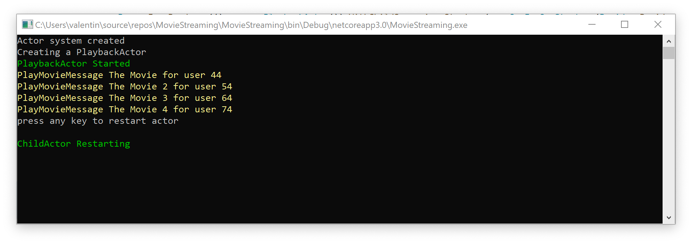
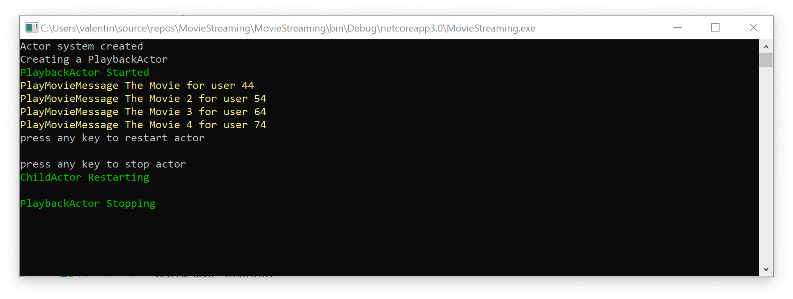

# Урок 2: Обработка сообщений жизненного цикла актора.

В этом уроке мы рассмотрим, как обрабатывать системные сообщения, которые представляют различные этапы жизненного цикла актора.

В сегодняшнем демонстрационном приложении, мы будем постепенно добавлять обработчики для различных этапов жизненного цикла актора PlaybackActor. 

Но прежде чем мы начнём, нам нужно внести некоторые изменения в наш проект.

Прежде всего, давайте добавим несколько дополнительных описаний фильмов в наш проект.

```c#
system.Root.Send(pid, new PlayMovieMessage("The Movie", 44));
system.Root.Send(pid, new PlayMovieMessage("The Movie 2", 54));
system.Root.Send(pid, new PlayMovieMessage("The Movie 3", 64));
system.Root.Send(pid, new PlayMovieMessage("The Movie 4", 74));

```

Далее добавим новый класс ColorConsole, который позволит менять цвет выводимого на консоль сообщения без лишних трудозатрат.

```c#
public static class ColorConsole
{
    public static void WriteLineGreen(string message)
    {
        var beforeColor = Console.ForegroundColor;

        Console.ForegroundColor = ConsoleColor.Green;

        Console.WriteLine(message);

        Console.ForegroundColor = beforeColor;
    }

    public static void WriteLineYellow(string message)
    {
        var beforeColor = Console.ForegroundColor;

        Console.ForegroundColor = ConsoleColor.Yellow;

        Console.WriteLine(message);

        Console.ForegroundColor = beforeColor;
    }
}
```

И на последок немного отредактируем наш актор, что бы он мог использовать класс `ColorConsole()` и выводить содержимое сообщения на консоль жёлтым цветом, а так же обрабатывать различные типы сообщений каждый в своём методе.

```c#
public class PlaybackActor : IActor
{
    public PlaybackActor() => Console.WriteLine("Creating a PlaybackActor");
    public Task ReceiveAsync(IContext context)
    {
        switch (context.Message)
        {
            case PlayMovieMessage msg:
                ProcessPlayMovieMessage(msg);
                break;
        }
        return Actor.Done;
    }

    private void ProcessPlayMovieMessage(PlayMovieMessage msg)
    {
        ColorConsole.WriteLineYellow($"PlayMovieMessage {msg.MovieTitle} for user {msg.UserId}");
    }
}
```

Запустим наше приложение и убедимся что все работает правильно.


Теперь после всех необходимых приготовлений мы можем, приступим к изучению системных сообщений. И мы начнём наше знакомство с сообщения `Started`.

### Started

Для того, что бы иметь возможность обработать момент старта актора используется системное сообщение `Started`. Итак, давайте добавим возможность обработки сообщения `Started` в метод `ReceiveAsync()`.

```c#
public class PlaybackActor : IActor
{
    public PlaybackActor() => Console.WriteLine("Creating a PlaybackActor");
    public Task ReceiveAsync(IContext context)
    {
        switch (context.Message)
        {
            case Started msg:
                ProcessStartedMessage(msg);
                break;
            
            case PlayMovieMessage msg:
                ProcessPlayMovieMessage(msg);
                break;
        }
        return Actor.Done;
    }
}
```

Теперь реализуем метод `ProcessStartedMessage()` в классе `PlaybackActor`.

```c#
private void ProcessStartedMessage(Started msg)
{
    ColorConsole.WriteLineGreen("PlaybackActor Started");
}
```

Все что будет делать метод `ProcessStartedMessage()` это выводить зелёным цветом сообщение на консоль о том, что наш актор успешно запустился. 

Давайте запустим наше приложение и посмотрим что у нас получилось.


Как вы видите, система акторов создала экземпляр актора `PlaybackActor` и отправила ему сообщение `Started`. Так же следует помнить, что системное сообщение `Started` всегда будет обработано первым. То есть если вам нужно произвести инициализацию вашего актора до запуска процесса обработки пользовательских сообщений. Этот код следует поменять в обработчик сообщения `Started`.

### Restarting

Если в акторе произойдет какой либо сбой, для его устранения, система акторов его перезагрузит. Для того что бы проинформировать актор, о перезагрузке, сушествует сообшение `Restarting`.

В отличии от сообшения `Started`, работа с сообшением `Restarting` будет не много отличаться. 

Прежде всего нам нужно создать новое сообшение под названием `Recoverable`. Данное сообшение будет сигнализировать дочернему актору о том что нужно сгенерировать исключение, для того что бы сэмитировать сбой актора. Далее создадим сам дочерний актор `ChildActor` и добавим в его метод `ReceiveAsync()` код для обработки сообшения `Restarting` и `Recoverable`.

```c#
public Task ReceiveAsync(IContext context)
{
    switch (context.Message)
    {
        case Restarting msg:
            ProcessRestartingMessage(msg);
            break;

        case Recoverable msg:
            ProcessRecoverableMessage(msg);
            break;
    }
    return Actor.Done;
}
```


```c#
private void ProcessRestartingMessage(Restarting msg)
{
    ColorConsole.WriteLineGreen("ChildActor Restarting");
}
```


```c#
private void ProcessRecoverableMessage(Recoverable msg)
{
    throw new Exception();
}
```

Теперь изменим актор `PlaybackActor` так что бы он мог принимать наши новые сообшения.

```c#
public class PlaybackActor : IActor
{
    public PlaybackActor() => Console.WriteLine("Creating a PlaybackActor");
    public Task ReceiveAsync(IContext context)
    {
        switch (context.Message)
        {
            case Started msg:
                ProcessStartedMessage(msg);
                break;

            case PlayMovieMessage msg:
                ProcessPlayMovieMessage(msg);
                break;

            case Recoverable msg:
                ProcessRecoverableMessage(context, msg);
                break;
        }
        return Actor.Done;
   }

    private void ProcessStartedMessage(Started msg)
    {
        ColorConsole.WriteLineGreen("PlaybackActor Started");
    }

    private void ProcessPlayMovieMessage(PlayMovieMessage msg)
    {
        ColorConsole.WriteLineYellow($"PlayMovieMessage {msg.MovieTitle} for user {msg.UserId}");
    }

    private void ProcessRecoverableMessage(IContext context, Recoverable msg)
    {
        PID child;

        if (context.Children == null || context.Children.Count == 0)
        {
            var props = Props.FromProducer(() => new ChildActor());
            child = context.Spawn(props);
        }
        else
        {
            child = context.Children.First();
        }

        context.Forward(child);
    }
```

В методе `ProcessRecoverableMessage` мы определяем есть ли дочерний актор у нашего класса и если его нет, то мы его создаем. Если же он есть, мы извлекаем его PID и сохряняем в переменную child. После того как мы получили PID дочернего актора мы пересылаем ему сообшение `Recoverable`, с помошью метода  `context.Forward(child);`.

Теперь все что нам осталось сделать это изменить класс `Program` что бы он мог поддерживать стратегию наблюдения за дочерними акторами. Более подробно об этом вы узнаете в следующих уроках, а пока просто скопируйте ниже приведенный код в ваше приложение.

```c#
class Program
{
    static void Main(string[] args)
    {
        var system = new ActorSystem();
        Console.WriteLine("Actor system created");

        var props = Props.FromProducer(() => new PlaybackActor()).WithChildSupervisorStrategy(new OneForOneStrategy(Decider.Decide, 1, null));
        var pid = system.Root.Spawn(props);

        system.Root.Send(pid, new PlayMovieMessage("The Movie", 44));
        system.Root.Send(pid, new PlayMovieMessage("The Movie 2", 54));
        system.Root.Send(pid, new PlayMovieMessage("The Movie 3", 64));
        system.Root.Send(pid, new PlayMovieMessage("The Movie 4", 74));

        Thread.Sleep(50);
        Console.WriteLine("press any key to restart actor");
        Console.ReadLine();

        system.Root.Send(pid, new Recoverable()); 
        Console.ReadLine();
    }

    private class Decider
    {
        public static SupervisorDirective Decide(PID pid, Exception reason)
        {
            return SupervisorDirective.Restart;
        }
    }
}
```

Запустив наше тестовое приложение вы увидите что дочерний актор был перезагружен и проинформирован об этом.



### Stopping

Что бы оповестить актор о том что он в скоре будет остановлен, система акторов посылает ему сообшение `Stopping`. 

Обработка остановки актора, может понадобиться, тогда когда вы хотите освободить используемые ресурсы. К примеру. Этими ресурсами может быть подключение к базе данных или открытый дескриптор файла.

Давайте реализуем обработку сообшения `Stopping` в нашем акторе. Для этого добавим обработку сообшения `Stopping` в метод `ReceiveAsync()` . 

```c#
public Task ReceiveAsync(IContext context)
{
    switch (context.Message)
    {
        case Started msg:
            ProcessStartedMessage(msg);
            break;
            
        case PlayMovieMessage msg:
            ProcessPlayMovieMessage(msg);
            break;
        
        case Stopping msg:
            ProcessStoppingMessage(msg);
            break;
    }
    return Actor.Done;
}
```

И реализуем метод `ProcessStoppingMessage()` . Который будет выдавать сообшение об остановки на консоль.

```c#
private void ProcessStoppingMessage(Stopping msg)
{
    ColorConsole.WriteLineGreen("PlaybackActor Stopping");
}
```

Для того что бы остановить актор нам нужно воспользоваться методом `RootContex.Stop()`  и передать ему PID актора который мы хотим остановить. Давайте изменим наш класс `Program` так что бы он мог останавливал наш актор.

```c#
class Program
{
    static void Main(string[] args)
    {
        var system = new ActorSystem();
        Console.WriteLine("Actor system created");

        var props = Props.FromProducer(() => new PlaybackActor()).WithChildSupervisorStrategy(new OneForOneStrategy(Decider.Decide, 1, null));
        var pid = system.Root.Spawn(props);

        system.Root.Send(pid, new PlayMovieMessage("The Movie", 44));
        system.Root.Send(pid, new PlayMovieMessage("The Movie 2", 54));
        system.Root.Send(pid, new PlayMovieMessage("The Movie 3", 64));
        system.Root.Send(pid, new PlayMovieMessage("The Movie 4", 74));

        Thread.Sleep(50);
        Console.WriteLine("press any key to restart actor");
        Console.ReadLine();

        system.Root.Send(pid, new Recoverable());

        Console.WriteLine("press any key to stop actor");
        Console.ReadLine();
        system.Root.Stop(pid);

        Console.ReadLine();
    }

    private class Decider
    {
        public static SupervisorDirective Decide(PID pid, Exception reason)
        {
            return SupervisorDirective.Restart;
        }
    }
}
```

Теперь когда мы запустим наше приложение и нажмем любую клавишу, мы увидим что наш актор получил оповешение о своей скорой остановке.




