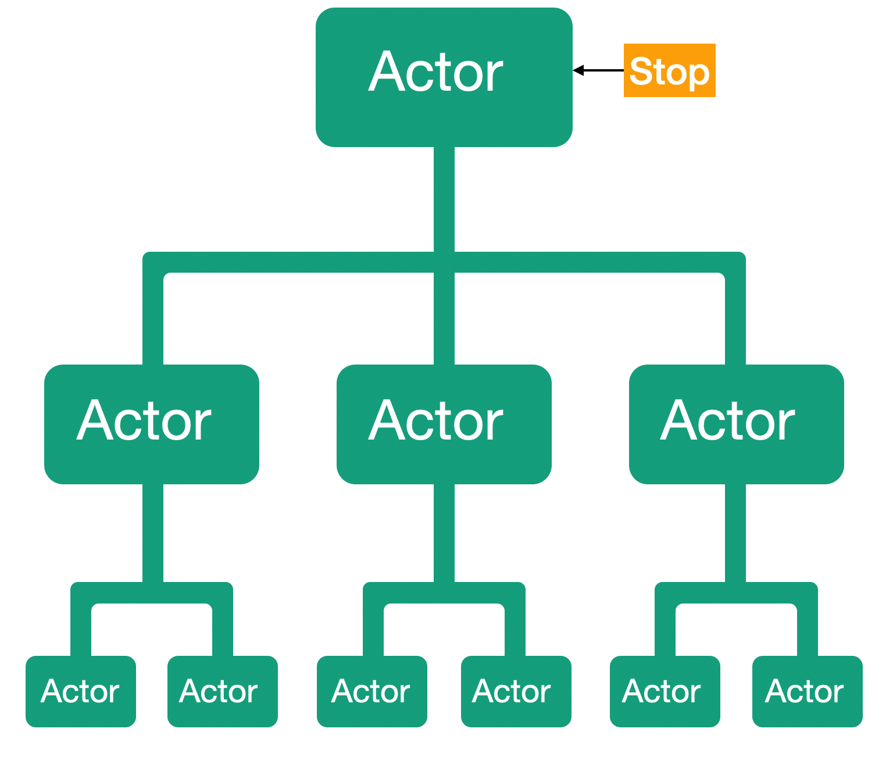

# Урок 3: Завершение работы актора и иерархия акторов.

Итак, давайте посмотрим, что произойдёт, когда наш актор завершает свою работу. И что в этот момент происходит с иерархией акторов, если наш актор был частью этой иерархии.

Когда мы завершаем работу отдельного актора, к примеру, посылаем сообщение `Stop`, первое что происходит, это остановка обработки всех входящих пользовательских сообщений. То есть из почтового ящика больше не будут извлекаться и обрабатываться входящие сообщения Исключение будет сделано, только для сообщения, которое уже находится в обработке. Как только его обработка будет завершена, не одно сообщение более не будет обработано.

Все сообщения, отправленные на адрес остановленного актора, будут попадать в специальный канал под названием `DeadLetter`.

После того как актор будет полностью остановлен, мы получим системное сообщение Stopped() с этого момента наш актор мертв.

Что произойдёт если мы остановим актор у которого есть дочерние акторы? Давайте оправим сообщение об остановке нашему главному актору и посмотрим что произойдёт.

Если у актора есть дочерние акторы то он отправит им сообщение об остановке.

Если же у дочерних акторов есть свои дочерние акторы, то тогда дочерние акторы отправят сообщение об остановке своим дочерним акторам.

Только после того как дочерние акторы будут полностью остановлены, родительский актор получит сообщение `Stopped()`. Таким образом, мы имеем упорядоченный и контролируемый способ завершения работы акторов.

Платформа Proto.Actor предоставляет несколько способов для остановки акторов. Но основным является вызов метода `Stop(PID)` с указанием PID актора который нужно остановить.