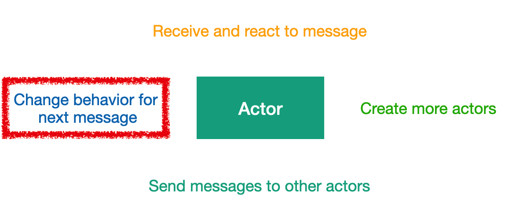
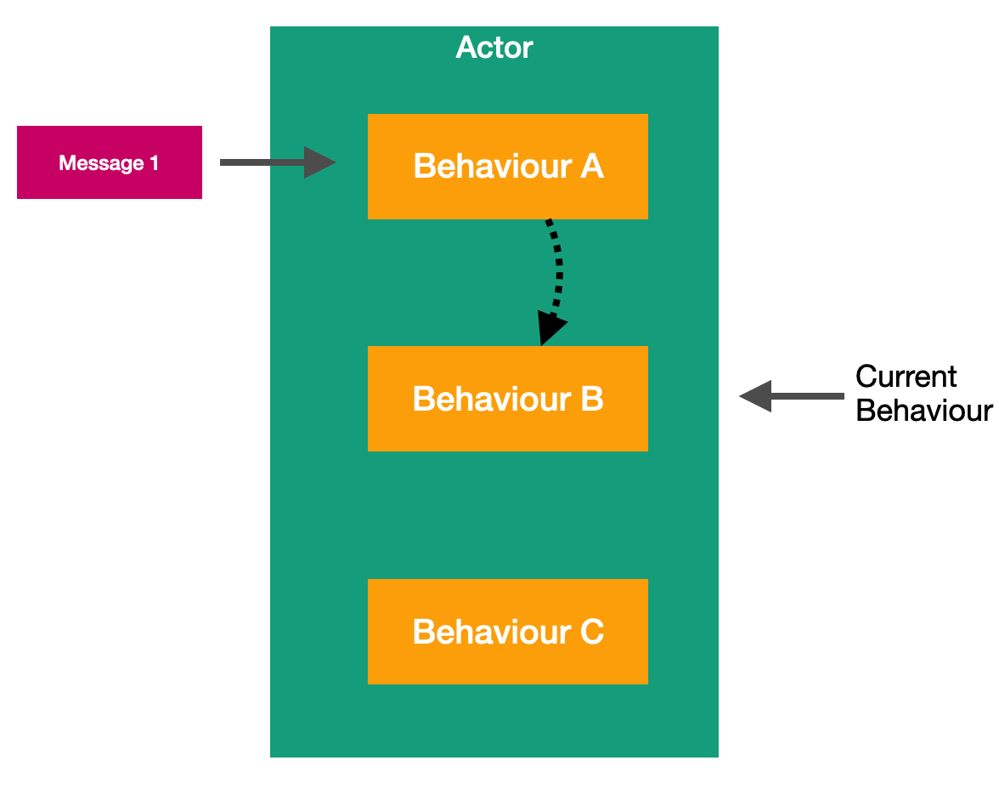

# Урок 5: Динамическое изменение поведения актора.

Раннее в нашем курсе мы уже упоминали о четырёх ключевых особенностях актора. Одной из этих особенностей является способность менять своё поведение, при обработке следующего сообщения



Такое переключаемое поведение акторов позволяет нам представлять различные поведенческие состояния, в которых может находиться наш актор. Без использования оператора if и else. 

К примеру, у нас есть актор, у которого есть три типа поведения. Поведение A, B и С.


Когда мы создаём экземпляр нашего актора, он автоматически инициализируется поведением A. То есть когда актор получит первое сообщение, оно будет обработано в соответствии с логикой поведения A.


В рамках обработки этого сообщения актор, может изменить своё поведение на другое. Таким образом, в данном примере он переходит от поведения A к поведению B. 



Теперь, когда актор получит новое сообщение, он будет использовать бизнес логику из поведения B для обработки этого сообщения.


Если в поведении B будет находиться логика, которая переключит актор на поведении C, то при получении следующего сообщения актор обработает это сообщение по алгоритмам, заложенным в поведении C.

Для работы с поведением в платформе Proto.Actor есть специальный класс `Behavior()`. Вы можете использовать данный класс в вашем акторе, для того, что бы иметь возможность динамически менять поведение вашего актора во время исполнения программы.

Работа с классом `Behavior()` заключается в передаче ему, методов реализующих бизнес логику поведения. Передать соответствующие методы вы можете как на этапе создания экземпляра класса `Behavior()` с помощью конструктора класса, так и с помощью методов `Behavior.Become()` и `Behavior.BecomeStacked()`. Отличие метода `Behavior.Become()` от `Behavior.BecomeStacked()` заключается в том, что метод `Behavior.Become()` очищает стэк перед добавлением нового поведения. В свою очередь, метод `Behavior.BecomeStacked()` добавляет новое поведение в стэк без удаления ранее добавленных элементов. Для того что бы удалить поведение из класс `Behavior()`, существует метод `Behavior.UnbecomeStacked()`. 

Для того, что бы наш актор при обработке входящих сообщений использовал класс `Behavior()`, нам нужно передавать все входящие сообщения в метод `Behavior.ReceiveAsync()`. Сделать это можно следующим образом.

```c#
public Task ReceiveAsync(IContext context) => Behavior.ReceiveAsync(context);
```

В следующих уроках, мы рассмотрим на реальных примерах как можно использовать класс  `Behavior()` в наших акторах.

