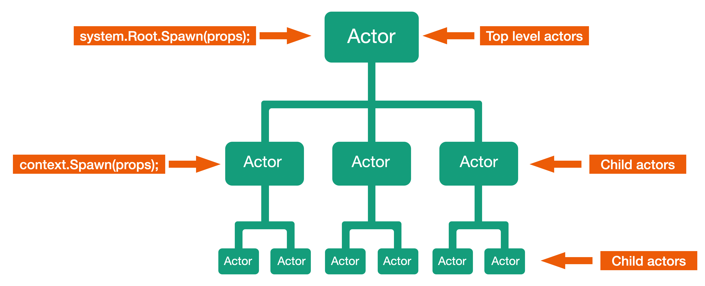

# Урок 1: Супервизор и иерархия акторов.

Давайте начнём этот модуль, с более глубокого погружения в иерархию акторов и понятия супервизора. 

В первом модуле нашего курса, мы уже познакомились с базовыми понятиями иерархии акторов и супервизора. Когда у нашего актора были дочерние акторы и для них наш актор был родительским.

Иерархия супервизора определяет порядок создания акторов друг другом: каждый актор, создающий другие акторы, является супервизором для созданных им дочерних акторов.

Иерархия остаётся фиксированной на протяжении всего жизненного цикла дочернего актора. После создания родителем дочерний актор находится под постоянным наблюдением родителя до самой остановки; в Proto.Actor нет такого понятия, как усыновление (или удочерение). Единственная возможность для супервизора отказаться от родительских обязанностей - остановить дочерние акторы. Поэтому так важно с самого начала выбрать правильную иерархию акторов в приложении, особенно если вы не планируете останавливать части иерархии для замены их совершенно другими поддеревьями акторов.

Акторы, наиболее подверженные опасностям (для которых наиболее вероятны аварии), должны находиться в иерархии как можно ниже. Ошибки, возникающие глубоко в иерархии, могут быть обработаны большим числом супервизоров, чем ошибки, возникающие ближе к вершине. Когда ошибка возникает на верхнем уровне системы акторов, она может вызвать перезапуск всех акторов верхнего уровня или даже остановить систему акторов.

Для создания корневых акторов мы применяем метод.

`system.Root.Spawn(props);`

После того как мы создали, корневые акторы из кода этих акторов мы можем создать их дочерние акторы с помощью метода.

`context.Spawn(props);`

Теперь, когда вы чуть больше узнали об иерархии супервизоров в при­ложении, давайте перейдем к следующему уроку, где мы с вами посмотрим как реализовать иерархию акторов на практике.