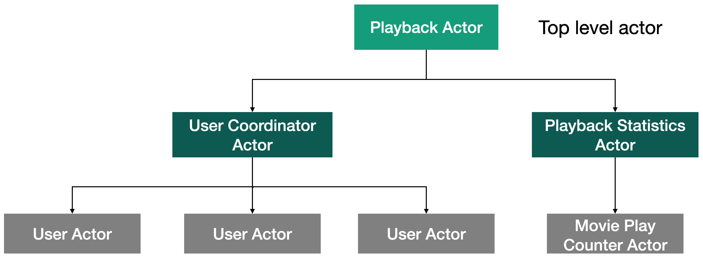
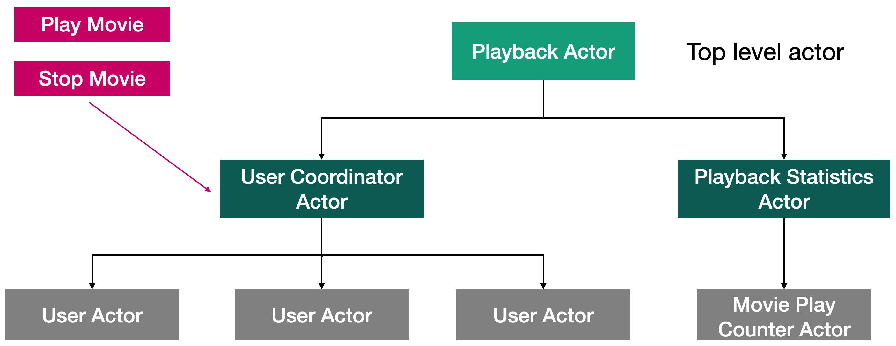

# Урок 2: Обзор приложения демонстрирующего возможности супервизора и иерархия акторов.

Итак, давайте посмотрим на иерархию акторов, которую мы будем создавать на протяжении этого модуля.

Мы начнём создания нашего приложения с актора находящегося на вершине иерархии акторов. Данный актор будет называться `PlaybackActor()`. Он будет отвечать непосредственно за воспроизведение фильмов. У данного актора будут два дочерних актора. Первый дочерний актор под названием `UserCoordinatorActor()` отвечает за создание одного или нескольких `UserActor()`.

Мы создаём экземпляр `UserActor()` для каждого конечного пользователя, который смотрит фильм. Начальную версию `UserActor()` мы создавали в предыдущем модуле.

У `PlaybackActor()` так же имеется второй дочерний актор под названием `PlaybackStatisticsActor()` , данный актор является родительским актором для актора `MoviePlayCounterActor()`.  Задачей актора `MoviePlayCounterActor()`  является подсчёт количества раз воспроизведения каждого фильма.

Также у нас имеется пара сообщений сообщение `PlayMovieMessage()` и сообщение `StopMovieMessage()` данные сообщения служат для начала и остановки воспроизведения фильмов.

Данные сообщения имеют UserId, и при попадании их в `UserCoordinatorActor()`, `UserCoordinatorActor()` будет проверять, если для данного UserId не существует подходящего экземпляра `UserActor()` то тогда `UserCoordinatorActor()` создаст его. Затем `UserCoordinatorActor()` передаст нужному `UserActor()` сообщения о начале воспроизведении или остановке воспроизведения фильма.  

Когда `UserActor()` начнёт воспроизводить фильм, он создаст экземпляр сообщения `IncrementPlayCountMessage()` и отправит его `MoviePlayCounterActor()` . В свою очередь `MoviePlayCounterActor()` увеличит счётчик воспроизведения фильма на единицу. Таким образом, `MoviePlayCounterActor()` будет отслеживать, сколько раз каждый фильм был воспроизведён.

