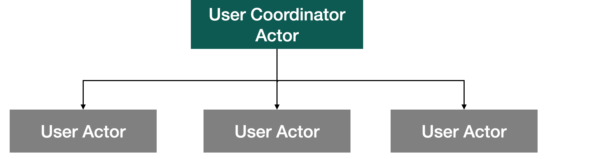
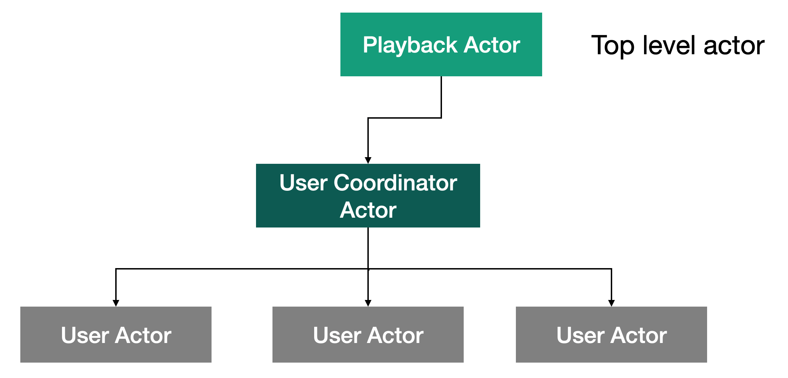
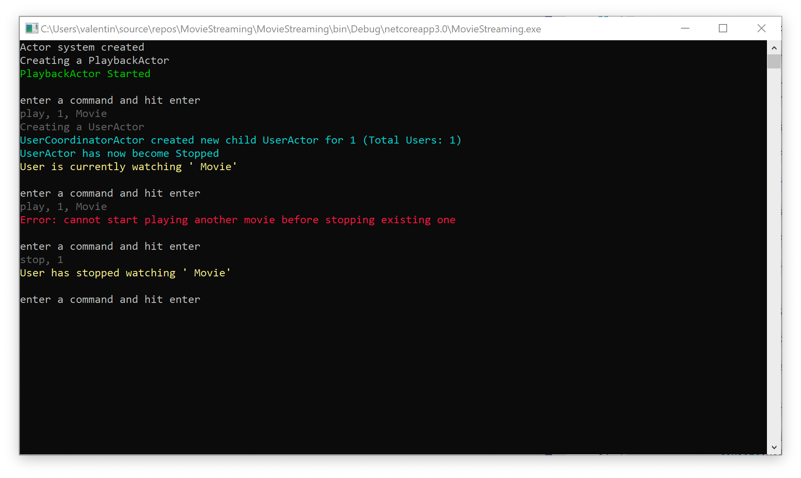

# Урок 4: Создание UserCoordinatorActor.

Итак, давайте приступим к созданию окончательной архитектуры нашего приложения. В этом уроке мы добавим `UserCoordinatorActor()` в нашу иерархию акторов. Данный актор будет отвечать за создание дочерних акторов и отправки им различных сообщений.



Прежде всего, нам понадобится сделать небольшую подготовительную работу. Сначала нам нужно добавить UserId в сообщение `StopMovieMessage()`.

```c#
public class StopMovieMessage
{
    public int UserId { get; private set; }

    public StopMovieMessage(int userId)
    {
        UserId = userId;
    }
}
```

Теперь давайте добавим UserId в класс `UserActor()`

```c#
 public class UserActor : IActor
 {
        private int _id;
   
				public UserActor(int id)
        {
            _id = id;
        }
```

Далее нам нужно добавить пару сообщений в папку Messages. Первое сообщение будет называться `RequestActorPid()` и будет служить для запроса Pid нужного актора.

```c#
public class RequestActorPid
{
}
```

Второе сообщение под названием `ResponseActorPid()` используется для ответа на `RequestActorPid()` и содержит Pid нужного актора.

```c#
public class ResponseActorPid
{
    public PID Pid { get; }

    public ResponseActorPid(PID pid)
    {
        Pid = pid;
    }
}
```

Теперь мы можем непосредственно приступить к созданию класса `UserCoordinatorActor()`. Давайте перейдём в папку Actors и добавим класс `UserCoordinatorActor()`.

```c#
public class UserCoordinatorActor : IActor
{
    private readonly Dictionary<int, PID> _users = new Dictionary<int, PID>();

    public Task ReceiveAsync(IContext context)
    {
        switch (context.Message)
        {
            case PlayMovieMessage msg:
                ProcessPlayMovieMessage(context, msg);
                break;

            case StopMovieMessage msg:
                ProcessStopMovieMessage(context, msg);
                break;
        }
        return Actor.Done;
    }

    private void ProcessPlayMovieMessage(IContext context, PlayMovieMessage msg)
    {
        CreateChildUserIfNotExists(context, msg.UserId);
        var childActorRef = _users[msg.UserId];
        context.Send(childActorRef, msg);
    }

    private void CreateChildUserIfNotExists(IContext context, int userId)
    {
        if (!_users.ContainsKey(userId))
        {
            var props = Props.FromProducer(() => new UserActor(userId));
            var pid = context.SpawnNamed(props, $"User{userId}");
            _users.Add(userId, pid);
            ColorConsole.WriteLineCyan($"UserCoordinatorActor created new child UserActor for {userId} (Total Users: {_users.Count})");
        }
    }

    private void ProcessStopMovieMessage(IContext context, StopMovieMessage msg)
    {
        CreateChildUserIfNotExists(context, msg.UserId);
        var childActorRef = _users[msg.UserId];
        context.Send(childActorRef, msg);
    }
}
```

Как вы видите, данный актор проверяет, существует ли подходящий дочерний актор и если его нет, то создаёт его и затем добавляет ссылку на него в словарь `_users`. Далее используя этот словарь, он извлекает ссылку на подходящий актор и пересылает ему сообщение.

Теперь нам нужно внести изменение в класс `PlaybackActor()` что бы он мог создавать экземпляр класса `UserCoordinatorActor()`и сохранять ссылку на него.



Для этого внесём необходимые изменения в метод `ProcessStartedMessage` для того, что бы он создавал дочерний актор `UserCoordinatorActor()` и сохранял ссылку, сразу после своего создания.

```c#
 public class PlaybackActor : IActor
 {
        private PID _userCoordinatorActorRef;
   
        private void ProcessStartedMessage(IContext context, Started msg)
        {
            ColorConsole.WriteLineGreen("PlaybackActor Started");

            var props = Props.FromProducer(() => new UserCoordinatorActor());
            _userCoordinatorActorRef = context.Spawn(props);
        }
```

А также добавим обработчик RequestActorPid в `PlaybackActor()`

```c#
public Task ReceiveAsync(IContext context)
{
    switch (context.Message)
    {
        case Started msg:
            ProcessStartedMessage(context, msg);
            break;

        case PlayMovieMessage msg:
            ProcessPlayMovieMessage(msg);
            break;

        case Recoverable msg:
            ProcessRecoverableMessage(context, msg);
            break;

        case Stopping msg:
            ProcessStoppingMessage(msg);
            break;

        case RequestActorPidMessage msg:
            ProcessRequestActorPidMessage(context, msg);
            break;
     }
     return Actor.Done;
}
```

Что бы `PlaybackActor()` мог отправлять ссылку на свой дочерний актор при запросе.

```c#
private void ProcessRequestActorPidMessage(IContext context, RequestActorPidMessage msg)
{
    context.Respond(new ResponseActorPidMessage(_userCoordinatorActorRef));
}
```

Теперь все что нам осталось сделать это добавить возможность управлять нашим приложением с помощью команд из консоли. Для этого давайте откроем наш класс `Program()` и внесём необходимые изменения. 

```c#
class Program
{
    static async Task Main(string[] args)
    {
        var system = new ActorSystem();
        Console.WriteLine("Actor system created");

        var props = Props.FromProducer(() => new PlaybackActor());
        var playbackPid = system.Root.Spawn(props);

        var actorPidMessage = await system.Root.RequestAsync<ResponseActorPidMessage>(playbackPid, new RequestActorPidMessage());
        var userCoordinatorActorPid = actorPidMessage.Pid;

        do
        {
            ShortPause();

            Console.WriteLine();
            Console.ForegroundColor = ConsoleColor.DarkGray;
            ColorConsole.WriteLineGray("enter a command and hit enter");

            var command = Console.ReadLine();

            if (command != null)
            {
                if (command.StartsWith("play"))
                {
                    var userId = int.Parse(command.Split(',')[1]);
                    var movieTitle = command.Split(',')[2];

                    system.Root.Send(userCoordinatorActorPid, new PlayMovieMessage(movieTitle, userId));
                }
                else if (command.StartsWith("stop"))
                {
                    var userId = int.Parse(command.Split(',')[1]);

                    system.Root.Send(userCoordinatorActorPid, new StopMovieMessage(userId));
                }
                else if (command == "exit")
                {
                    Terminate();
                }
            }
        } while (true);

        static void ShortPause()
        {
            Thread.Sleep(250);
        }

        static void Terminate()
        {
            Console.WriteLine("Actor system shutdown");
            Console.ReadKey();
            Environment.Exit(1);
        }
    }
}
```

Как вы видите, здесь происходит считывание команд с консоли с последующей пересылкой соответствующих сообщений актору `UserCoordinatorActor()`.

Давайте запустим наш проект и посмотрим что у нас получилось.


При вводе команды play,1, Movie происходит старт воспроизведения фильма.


При повторном введении этой же команды происходит ввод сообщения о job,rt на консоль. так как воспроизведение фильма уже запущено.

Если же мы хотим остановить его воспроизведение, то нам следует набрать команду stop.

