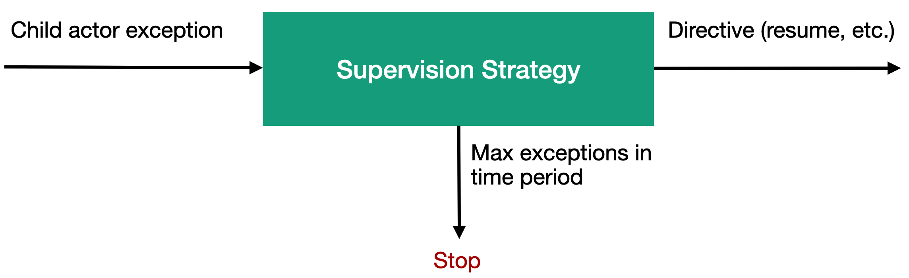

# Урок 7: Стратегии контроля состояния дочерних акторов.

В предыдущем уроке, мы с вами узнали что родительские акторы могут отслеживать состояние своих дочерних акторов и при необходимости корректировать его. В этом уроке мы узнаем с помощью каких механизмов осуществляется данный контроль. Когда мы создаём свой актор с помощью метода Props.Spawn() мы автоматически получаем стратегию контроля за дочерними актора (supervision strategy) которая предустановленна в платформе Proto.Actor по умолчанию. В случае необходимости вы сможем переопределить стратегию по молчанию и задать свою собственную стратегию для работы с дочерними акторами с помощью метода `WithChildSupervisorStrategy()` . 

Таким образом, стратегия наблюдения за дочерними акторами, берет входящее сообщение содержащее исключение сгенерированное дочерним актором и в зависимости от бизнес логики содержащейся в стратегии и выдаёт наиболее подходящую директиву для сложившейся ситуации.

К примеру, данной директивой может быть, рассмотренная в предыдущем уроке, команда на возобновление работы дочернего актора. В дополнение к тому, что вы можете написать свою собственную стратегию, для контроля состояния дочерних акторов, вы также можете написать метод, который будет реализовывать делегат Decider.  

`public delegate SupervisorDirective Decider(PID pid, Exception reason);`

Данный метод будет использоваться встроенными стратегиями для принятия решения. К примеру вы можете указать максимальное количество исключений по достижению которого дочерний актор будет остановлен.

В платформе Proto.Actor существует несколько встроенных стратегий для контроля над дочерними акторами, давайте рассмотрим их более подробно.

#### Стратегия OneForOneStrategy.

Данная стратегия будет применять полученную от метода Decider директиву только к дочернему актору, который сгенерировал исключение. Так, к примеру, если директива заключается в остановке дочернего актора, то будет остановлен только этот дочерний актор. Данная стратегия применяется по умолчанию при создании нового актора.

#### Стратегия AllForOneStrategy.

В отличие от стратегии OneForOneStrategy стратегия AllForOneStrategy применяет результирующую директиву ко всем дочерним акторам, а не только к актору, который сгенерировал исключение. Так, к примеру, здесь, как и ранее наш дочерний актор генерирует исключение, но на этот раз результирующая директива применяется не только к дочернему актору, который сгенерировал исключение, но и ко всем остальным дочерним акторам данного родительского актора. 

Стратегия AllForOneStrategy может быть полезна, если у нас есть дочерние акторы, сильно зависящие друг от друга, К примеру, если в одном из дочерних акторов произошла ошибка, то остальные дочерние акторы не смогут выполнять свою работу. Таким образом, AllForOneStrategy позволяет принять корректирующие меры для всех дочерних акторов, а не только для того актора, у которого произошёл сбой. 