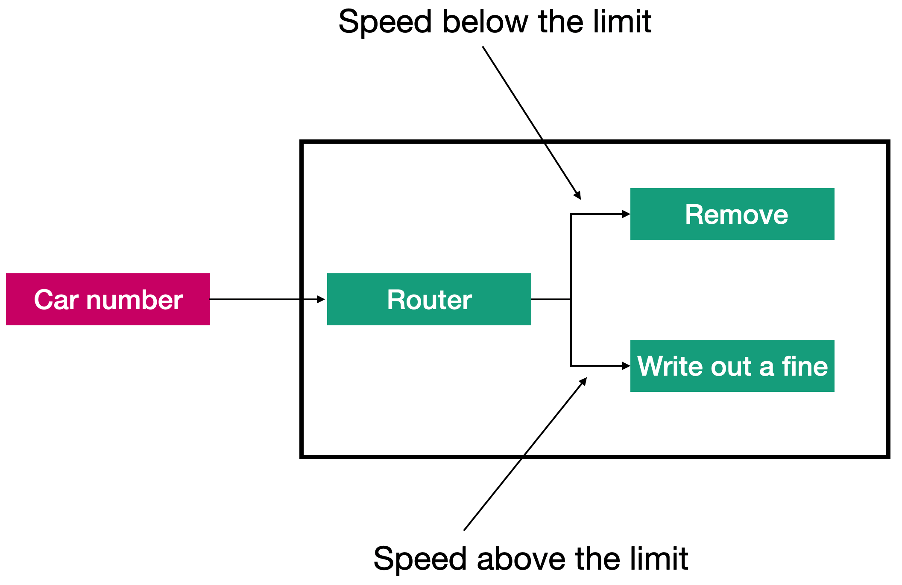

# Урок 1: Шаблон Маршрутиэатор.

Давайте рассмотрим, что представляет собой шаблон маршрутизатор в целом и когда и как он применяется, а потом разберём более детально реализацию каждого конкретного маршрутизатора.

Для наглядности мы будем рассматривать шаблон маршрутизатор на конкретном примере. Данный пример, будет, представлять собой, приложения для работы с дорожными камерами. Данное приложение будет анализировать скорость движения автомобиля и если скорость превышает установленный лимит, будет выписан штраф, если же скорость будет ниже установленного лимита сообщение содержащее номер и скорость автомобиля будет удалено. Для решения этой? задачи мы будем используем шаблон «Маршрутизатор». Как показано, маршрутизатор способен посылать сообщения в разные акторы в зависимости от содержимого сообщения.

Есть много причин использовать логику для выбора маршрута, по которому следует отправить сообщение. Но в основном, есть три причины для организации управления потоком сообщении? в приложениях.

#### Производительность.

На обработку сообщения уходит много времени, но есть возможность обработать сообщения параллельно. То есть сообщения можно обрабатывать несколькими акторами параллельно. В примере с дорожной камерой автомобили, попавшие на камеру, можно обрабатывать несколькими параллельными акторами, потому что вся логика обработки сосредоточена в пределах актора.

#### Получаемые сообщения имеют разное содержимое.

Сообщение име­ет атрибут (как номерной знак в нашем примере), в зависимости от значения которого сообщение должно обрабатываться разными акторами.

#### В зависимости от состояние маршрутизатора.

Например, когда камера работает в режиме резервирования, все сообщения должны передаваться на удаления; иначе они должны обрабатываться как обычно.

Во всех случаях (независимо от причины или конкретной используемои? логики) маршрутизатор должен решить, какому актору передать сообщение.

В этом модуле мы рассмотрим разные подходы к маршрутизации сообщении. Попутно познакомимся ещё с несколькими механизмами платформ Proto.Actor, которые могут пригодиться не только для реализации маршрутизаторов, но и для других процессов, например, когда необходимо обрабатывать сообщения по-разному, в зависимости от состояния актора. 