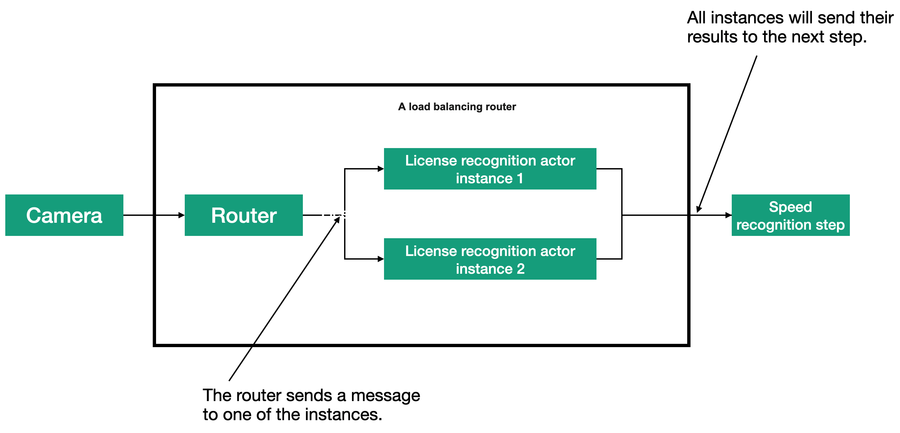
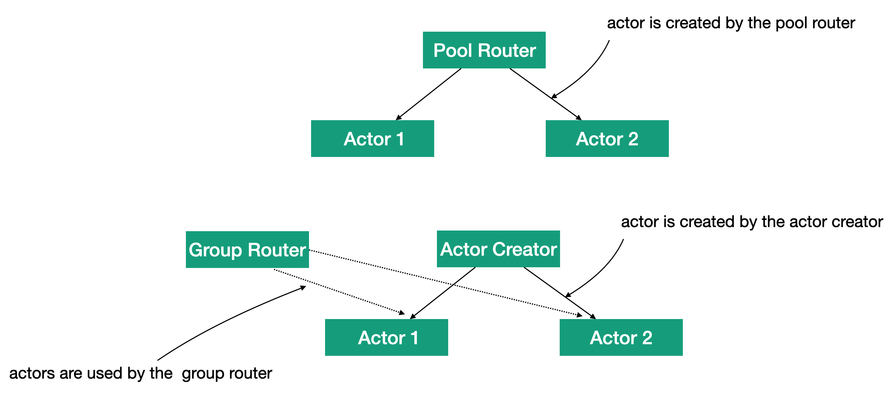

# Урок 2: Балансировка нагрузки с помощью маршрутиэаторов Proto.Actor.

Одна из главных причин использования маршрутизаторов это обеспечение равномерного распределение нагрузки между несколькими акторами, чтобы улучшить производительность системы, обрабатывающей большое количество сообщений. Это могут быть локальные акторы (вертикальное масштабирование) или акторы на удалённых серверах (горизонтальное масштабирование). Благодаря встроенной в платформу Proto.Actor поддержки маршрутизации, вы сможете с лёгкостью реализовать поддержку масштабирование в вашем приложении.

В нашем предыдущем примере с дорожной камерой относительно много времени занимает шаг распознавания номера. Чтобы организовать параллельное распознавание нескольких номеров, мы будем использовать маршрутизатор.

На представленном рисунке видно, что маршрутизатор способен посылать сообщения одному из экземпляров актора LicenseRecognition. Когда сообщение попадает в маршрутизатор, он выбирает один из доступных акторов и посылает сообщение этому актору. Получив следующее сообщение, маршрутизатор выбирает другой актор и посылает сообщение ему.

Для реализации данного маршрутизатора мы будем использовать встроенную поддержку маршрутизации в платформе Proto.Actor. В Proto.Actor есть разделение между маршрутизатором, содержащим логику маршрутизации, и актором, представляющим маршрутизатор. 

Логика маршрутизации решает, какой маршрут выбрать, и может использоваться внутри актора. Актор-маршрутизатор это самостоятельный актор, загружающий логику маршрутизации и другие настройки из конфигурации, и может управлять самими маршрутами.

В платформе Proto.Actor есть две разновидности встроенных маршрутизаторов.

#### Пул.

В пуле маршрутизаторы отвечают за создание акторов и удаление их из списка, когда те завершают работу. Пул можно использовать, когда все акторы создаются и распределяются, одинаково и нет необходимости предусматривать особые процедуры для создания акторов.

#### Группа.

В группе же маршрутизаторы, не управляют созданием акторов, маршрутами. Акторы создаются системой, а маршрутизатор использует операцию выбора акторов. Маршрутизатор с группой не управляет акторами. Управление акторами должно осуществляться где-то еще в системе. Группу можно использовать, когда требуется по-особенному управлять жизненным циклом акторов или требуется больше контроля над местом и временем создания акторов.

Пул проще, потому что поддерживает автоматическое управление акторами, но за эту простоту приходится платить отсутствием возможности настраивать логику отдельных акторов.

На рисунке, можно увидеть разницу между пулом и группой. При использовании пула акторы являются потомками маршрутизатора, а когда используется маршрутизатор с группой, акторы могут быть потомками любого другого актора (в данном примере - актора ActorCreator). Акторы необязательно должны быть потомками одного и того же родителя. Они просто должны создаваться и запускаться.

В платформе Proto.Actor имеется несколько встроенных маршрутизаторов. Давайте рассмотрим их более подробно.

- Round-robin — последовательная отправка сообщений акторам.
- Hash key — адресация по ключу в сообщении.
- Random — адресат выбирается случайным образом.
- Weighted round robin — то же, что и Round-robin, но с помощью весовых коэффициентов можно настраивать частоту отправки сообщений конкретным адресатам.
- Broadcast — сообщение отправляется всем акторам из группы.