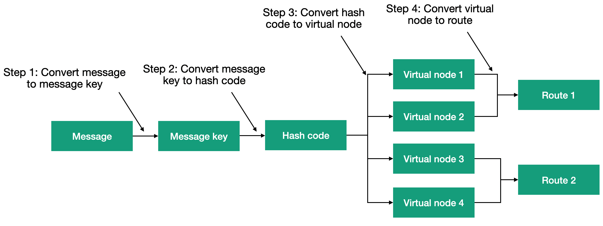

# Урок 5. Маршрутиэатор ConsistentHashing.

Как вы видели в предыдущих уроках, маршрутизаторы дают отличный способ для создания вертикального и горизонтального масштабированных систем. Но все маршрутизаторы, которые мы рассматривали ранее, полагались на выбор случайного маршрута для обработки сообщения. Но иногда нам нужно, чтобы сообщения с общим свойством отправлялись по одному и тому же маршруту. К примеру, вы можете создать хранилище ключ-значение, которое будет хранить свои данные в базе данных. В этом случае, общим признаком между каждым сообщением является ключ, который идентифицирует элемент в базе данных.

Вернёмся к нашему примеру с дорожной камерой. Мы можем представить каждую машину в виде отдельного актора и использовать номер машины в качестве ключа. Таким образом, наш маршрутизатор будет направлять сообщение содержащее штраф только нужному актору. И таким образом, мы сможем учитывать в акторе сколько раз в течение дня, автомобиль превышал скорости, и затем, в конце дня мы можем решить выписать штраф или же лишить водителя прав.

Для решения данной задачи, при использовании традиционных маршрутизаторов нам бы пришлось прибегнуть к таблице маршрутизации с постоянным обновлением таблицы маршрутизации. Однако такой подход требует большой координации для обновления таблицы маршрутизации при добавлении новых значений. В идеале, нам нужен маршрутизатор без сохранения состояния, который позволял бы нам выбирать определённый маршрут на основе сообщения.

Для этого маршрутизатор должен идентифицировать сообщения как похожие. С этой целью ConsistentHashing вычисляет хеш код сообщения и отображает его в один из маршрутов. Процесс отображения состоит из нескольких шагов, как показано ниже.



**Шаг 1** Преобразует сообщение в объект ключа сообщения. Похожие сообщения, например с одинаковым идентификационным номером, получат одинаковые ключи. Тип ключа совершенно не важен; единственное ограничение - для похожих сообщений всегда должны получаться одинаковые объекты ключей. Ключи для сообщений разных типов должны отличаться и иметь реализацию. Для преобразования сообщения в ключ служит интерфейс `IHashable()`.

**Шаг 2** Создаёт хеш-код на основе ключа сообщения. Этот хеш-код используется для выбора виртуального узла **(шаг 3)**, и на последнем **шаге (4)** выбирается конкретный маршрут для обработки всех сообщений, соответствующих этому виртуальному узлу. 

Первое, что бросается в глаза, это использование виртуального узла. Нельзя ли сразу по хеш-коду определить маршрут? Виртуальные узлы применяются, чтобы получить более равномерное распределение сообщений между маршрутами. Количество виртуальных узлов, обслуживаемых маршрутом, настраивается при помощи replicaCount. 

Создание экземпляра роутера ConsistentHashing не чем не отличается от создания других роутеров на платформе Proto.Actor

```c#
var system = new ActorSystem();
var context = new RootContext(system);
var props = context.NewConsistentHashPool(MyActorProps, 5);
var pid = context.Spawn(props);
for (var i = 0; i < 10; i++)
{
    context.Send(pid, new Message { Text = $"{i % 4}" });
}
```


