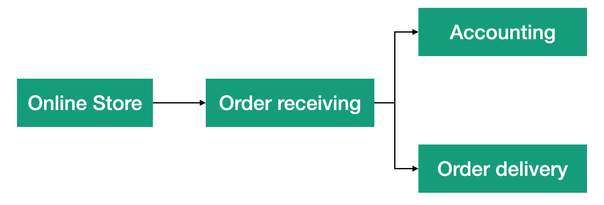
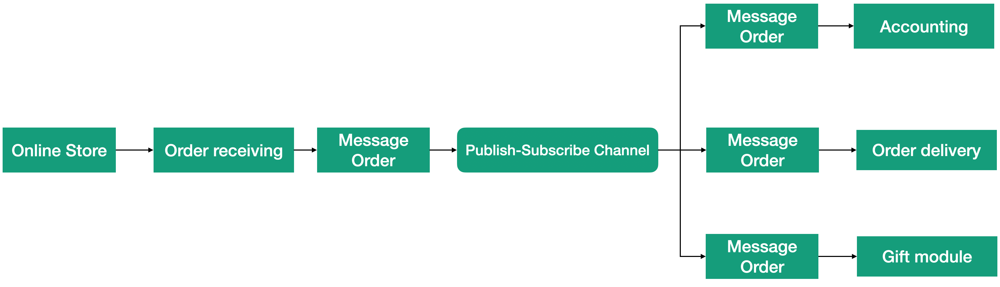

# Урок 3: Канал Иэдатель/подписчик.

Каналы «точка-точка» доставляют каждое сообщение только одному получателю, как описывалось в предыдущем уроке. Используя каналы этого вида, отправитель знает адресата. Но иногда отправитель может не знать, кому интересны его сообщения. В этом заключается самое большое отличие каналов «издатель/подписчик» от каналов «точка-точка». Канал принимает на себя обязанность следить за получателями, заинтересованными в сообщениях, и снимает её с отправителя. Он также может доставить одно сообщение нескольким получателям.

Допустим, у нас есть приложение онлайн-магазина. На первом шаге приложение принимает заказ. После этого система должна передать заказ на следующий этап - этап доставки заказа (например, книги) заказчику. Этап приёма заказа посылает сообщение этапу доставки заказа. Но для учёта товаров на складе мы также должны отправить заказ компоненту учёта. То есть полученный заказ должен быть отправлен двум компонентам системы, как показано на рисунке.

В качестве поощрительной меры мы решили делать клиентам маленькие подарки, когда они покупают книги. Для этого мы добавим в систему компонент отправки подарков, которому тоже нужно посылать сообщение с заказом. Каждый раз, когда добавляется новая подсистема, мы должны изменять первый шаг, чтобы добавить в него отправку сообщений дополнительным получателям. Избавиться от этой проблемы нам поможет канал «издатель/подписчик». Этот канал способен посылать одно и то же сообщение нескольким получателям, не требуя от отправителя хоть что-нибудь знать о получателях. На рисунке показано, как опубликованное сообщение пересылается подсистемам доставки и учёта.

Когда понадобится добавить возможность отправки подарков, мы просто подпишем этот компонент на получение сообщений, и нам не придется ничего менять в компоненте приёма заказов. Ещё одно преимущества каналов этого вида - количество и состав получателей может меняться в процессе работы. Например, подарки могут посылаться не всегда, а только в дни проведения акций. Используя этот канал, мы сможем добавлять компонент подарков в число подписчиков канала только в определённые периоды и исключать из подписчиков после окончания акции, как показано на рисунке.

Если получатель заинтересован в доставке сообщении? от издателя, он подписывается на канал. Когда издатель посылает сообщение, канал гарантирует его доставку всем подписчикам. С окончанием акции компонент рассылки подарков больше не нуждается в сообщениях с заказами, поэтому он аннулирует свою подписку на канал. Как результат методы канала можно разбить на две категории по их использованию. К первой относятся методы, используемые стороной, отправителем для публикации сообщений. Ко второй относятся методы, используемые стороной-получателем для управления подпиской. На рисунке показаны эти две категории методов.

Так как получатели могут самостоятельно подписывать себя на получение сообщений из канала, данное решение обладает большой гибкостью. Издателю не нужно знать, сколько подписчиков у него имеется. Может даже так получиться, что в какой-то момент у него не будет ни одного подписчика.

