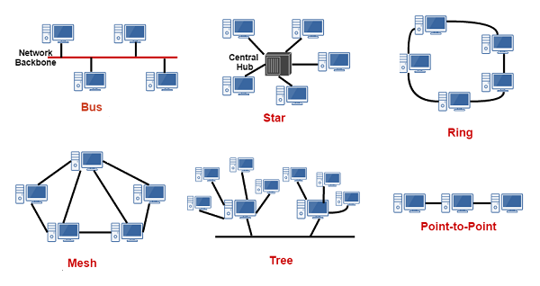

# Урок 1: Что такое горизонтальное масштабирование.

Обычно для организации взаимодействий между объектами по сети в большинстве сетевых технологии? используется метод блокирующего вызова удалённых процедур (Remote Procedure Call, RPC), который? стремится замаскировать различия между вызовами локальных и удалённых объектов.** Этот подход основан на идее, что модель локального программирования проще, поэтому предпочтительнее, если программист будет использовать ее, а внутренняя реализация обеспечит прозрачность удалённых взаимодействий. Этот способ хорошо работает для соединений типа «точка-точка», но никуда не годится для крупномасштабных сетевых приложений, в чем вы убедитесь в следующем разделе. В платформе Proto.Actor используется иной подход к масштабированию приложений. Он объединяет лучшие черты других подходов, благодаря чему мы получаем относительную прозрачность удалённых взаимодействий и можем использовать прежний прикладной код с акторами - далее вы убедитесь сами, что код на верхнем уровне остаётся неизменным.

Прежде чем углубиться в тему масштабирования, следует кратко познакомимся с используемой терминологией и некоторыми примерами топологии сетей,

#### Общая терминология.

Под термином узел (node) в этой главе мы будем подразумевать действующее приложение, поддерживающее возможность обмена данными по сети. Это точка подключения в топологии сети. Это часть распределенной системы. Несколько узлов может выполняться на одном физическом сер вере или на нескольких. На рисунке показаны некоторые типичные топологии сетей.

Узел наделён определённой ролью в распределённой? системе. Он отвечает за решение конкретных задач. Например, узел может быть частью распределённой базы данных или одним из нескольких веб-серверов, обеспечивающих доступ к системе через веб-интерфейс.

Для взаимодействий узел использует определённый транспортный протокол. Примерами таких транспортных протоколов могут служить TCP/IP и UDP. Сообщения, пересылаемые узлами друг другу с помощью транспортного протокола, должны кодироваться и декодироваться в блоки данных протокола (protocol data units). Блоки данных несут в себе двоичное представление сообщений в виде массивов байтов. Для преобразования сообщений в байты и обратно используются процедуры сериализации и десериализации соответственно. Для этих целей в платформе Proto.Actor имеется свой модуль сериализации, который мы коротко рассмотрим в этом модуле.

Узлы, входящие в состав одной распределенной системы, являются членами группы. Членство может быть статическим или динамическим (или даже смешанным). В случае статического членства количество узлов и роль каждого узла фиксированы и не могут изменяться на протяжении всего периода работы такой сети. Динамическое членство позволяет узлам играть разные роли и присоединяться к сети или отключаться от нее.

Статическое членство, как вы понимаете, проще в реализации. Все серверы поддерживают связи с другими узлами в сети, установленные в момент запуска. Но оно также наименее гибкое, узел нельзя просто заменить другим узлом, выполняющимся на другой машине с другим сетевым адресом.

Динамическое членство обладает большей гибкостью и позволяет группам узлов расширяться и сокращаться по мере необходимости. Оно позволяет восстанавливать общую работоспособность сети при выходе из строя некоторых узлов автоматической заменой их другими узлами. Но оно также сложнее в реализации. Для нормальной работы динамического членства требуется реализовать механизм динамического присоединения к группе или выхода из неё, обнаружения и устранения сбоев, выявления недоступных/отказавших узлов, а также предоставить некоторый? механизм обнаружения, который? будет помогать новым узлам находить группу в сети, потому что при динамическом членстве сетевые адреса определяются динамически, а не статически.

#### Причины использования модели распределенного программирования.

Если мы захотим развернуть наше приложение на нескольких серверах для улучшения его производительности. С использованием модели локального программирования то мы столкнёмся с четырьмя основными проблемами.

- Задержки - наличие сети между взаимодействующими объектами предполагает большие затраты времени на передачу каждого сооб­щения - примерное время извлечения сообщения из кеша L1 состав­ ляет что-то около 0.5 нс, время извлечения из основной памяти за­нимает примерно 100 нс, а для передачи пакета из Нидерландов в Калифорнию требуется около 150 мс - сюда также можно приплюсо­вать задержки из-за высокого трафика в часы пик, повторной пере­ дачи пакетов, разрывов соединения и т. д.
- Частичный отказ - определение работоспособности всех частей рас­пределенной системы - сложная задача, особенно когда некоторые части системы доступны непостоянно, могут отключаться и снова появляться.
- Доступ к памяти - операция получения ссылки на объект в памяти в локальной системе не может прерываться, в отличии от распределенной системы.
- Конкуренция - единый «хозяин» отсутствует, поэтому из-за факто­ров, перечисленных выше, последовательность выполнения сообшений может быть нарушена.

Из-за этих проблем применение модели локального программирования в распределённой среде заканчивается крахом. Но платформа Proto.Actor предлагает использовать распределённую модель для обоих видов окружений - распределённого и локального. Следует отметить что модель распределённого программирования упрощает создание распределённых приложений, но может сделать локальное программирование таким же сложным, как распределённое

Но времена изменились. Спустя два десятка лет мы вынуждены иметь дело с многоядерными процессорами. И все больше задач приходится решать в распределённом облаке. Преимущества использования модели распределённого программирования для создания локальных систем заключается в том, что она упрощает конкурентное программирование, как вы могли видеть в предыдущих главах. Мы уже привыкли к асинхронным взаимодействиям, научились бороться с частичными отказами, и используем обобщенный подход к конкурентному выполнению, что упрощает нам программирование для многопроцессорных систем и подготавливает нас к переходу в распределённую среду.