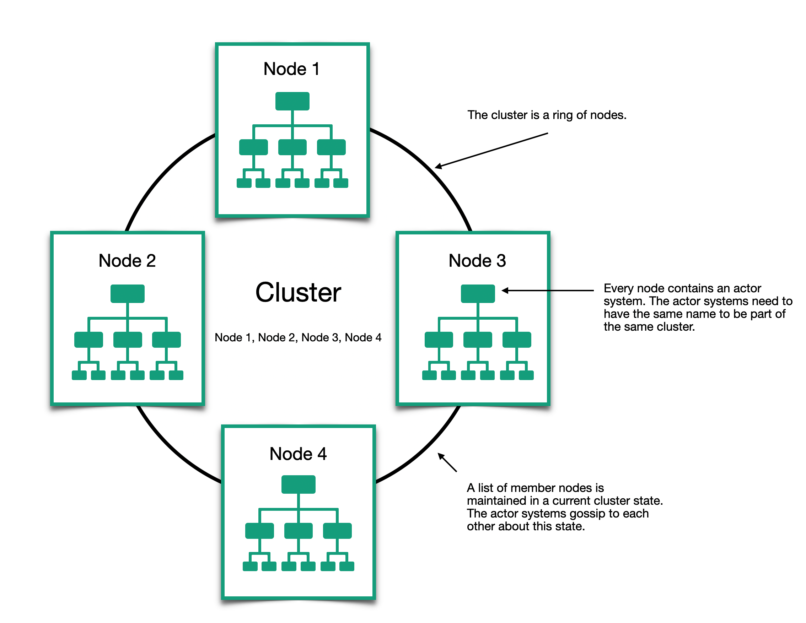

# Урок 1:  Зачем нужны кластеры?

Кластер - это динамическая группа узлов. На каждом узле имеется своя система акторов, прижимающая запросы из сети (подобно тому, как описывалось в главе 7). Кластеры конструируются на основе модуля Proto.Cluster и помогают поднять прозрачность местоположения акторов на новый уровень. Актор может существовать в локальной или удалённой системе и вообще находиться где угодно в пределах кластера; вам не придётся беспокоиться о его местонахождении в своем коде. На рисунке показан кластер с четырьмя узлами.

Конечной целью модуля Proto.Cluster является предоставление полностью автоматизированного способа распределения акторов, балансировки нагрузки и поддержание отказоустойчивости. В настоящее время модуль Proto.Cluster поддерживает следующие функции:

- членство в кластере - надежное членство для систем акторов.
- балансировка нагрузки - маршрутизация сообщений в кластере на ос­нове специализированного алгоритма.
- разделение точек - систему акторов можно разделить на поддеревья акторов, расположенные на разных узлах.

В этом уроке мы подробно рассмотрим все эти функции, уделив особое внимание членству в кластере и маршрутизации. Далее мы обсудим механизмы репликации состояния и автоматическую поддержку отказа устойчивости.

Приложение обработки данных с единственной целью - отличный пример кандидата на создание кластера. К таким приложениям можно отнести приложения распознавания образов или анализа социальных сетей в режиме реального времени. Узлы в таких приложениях могут добавляться или удаляться по мере увеличения или уменьшения нагрузки на приложение. Задания, осуществляющие обработку, находятся под наблюдением и если актор терпит неудачу, задание перезапускается, и такие попытки повторяются, пока обработка не завершится успехом. В данном модуле мы рассмотрим простой пример приложения такого типа. На рисунке показана его общая структура; 

Пока не обращайте особого внимания на детали, поскольку все они будут подробно рассматриваться на протяжении всего модуля.

А теперь перейдём к реализации нашего кластеризованного приложения подсчета слов. В следующем уроке мы углубимся в детали членства в кластере и посмотрим, как ведущие и ведомые акторы могут находить друг друга и сотрудничать для выполнения заданий.