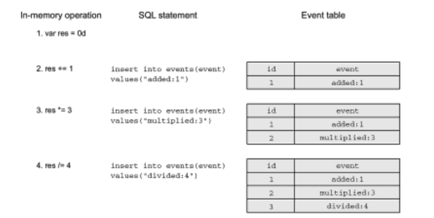

# Урок 1:  Что такое Event Sourcing.

Технология Event Sourcing (история событий) появилась довольно давно. Мы рассмотрим простой пример, демонстрирующий разницу между хранением истории событий и простых записей с информацией о состоянии, последнее из которых, как мы полагаем, уже хорошо вам знакомо. В этом примере мы реализуем калькулятор, который должен запоминать только последний вычисленный результат.

#### Обновление записей на месте.

Обновление записей на месте - простейший приём, который? применяется при использовании базы данных SQL для оперативной обработки транзакций (Online Transaction Processing, OLTP). На рисунке 1 показано, как можно использовать SQL-инструкции insert и update для сохранения результатов вычислений в калькуляторе.

В момент запуска калькулятор вставляет одну запись; инструкция поиска уже существующей записи для простоты опущена. Все вычисления выполняются непосредственно в базе данных, с использованием инструкции update для изменения записи в таблице. (Вы можете полагать, что каждая инструкция update выполняется в своей транзакции.)

На рис. 1 видно, что калькулятор отображает результат 0.75. После перезапуска приложение запрашивает результат, как показано на рис. 2

Все довольно просто; запись хранит только последний вычисленный результат. Однако в этом примере нет никакой возможности узнать, как пользователь пришёл к результату О.75 и какие промежуточные результаты имели место после окончания вычислении?. (Мы не учитываем, что теоретически можно наблюдать некоторые промежуточные результаты в SQL-зaпpocax, выполняющихся параллельна с инструкциями update на низком уровне изоляции.)

Если вы захотите узнать, какие вычисления производил пользователь, вам придётся сохранить их в отдельной таблице. Все вычисления выполняются внутри SQL-инструкций. Каждое после дующее вычисление зависит от предыдущего результата, хранящегося в записи.

#### Сохранение состояния без изменения

Далее описывается идея технологии Event Sourcing (история событий). Вместо хранения последнего результата в одной записи можно записывать все успешно выполненные операции в журнал в виде событий. Событие должно в точности описывать происходящее; в данном случае мы будем сохранять имя операции и ее аргумент. И снова в примере используются простые SQL-инструкции; журнал организован как простая таблица в базе данных. На рис. 3 показаны инструкции, запоминающие всю историю вычислений.

Вычисления выполняются в памяти; событие сохраняется после успеш**ной операции.** Столбец ID использует механизм последовательностей в базе данных, и его значение автоматически увеличивается на единицу в каждой новой записи. (Вы можете полагать, что вставка каждой записи выполняется в своей собственной транзакции или используется функция автоматического подтверждения.)

События описывают операции, выполненные успешно с момента на чального состояния. Для хранения результата используется простая переменная. Каждое событие преобразуется в строку, содержащую имя события и аргумент, разделённые двоеточием.

Теперь посмотрим, как калькулятор восстанавливает последнее известное состояние на основе событии?. Первоначально калькулятор инициализируется значением О и затем последовательно выполняет все сохраненные операции в том же порядке. Приложение читает события, преобразует их в операции, выполняет эти операции и в конечном счёте получает значение 0.75, как показано на рис. 4.

Как видите, Event Sourcing (история событий) - простая технология. В следующем разделе мы посмотрим, как эту технологию можно исполь­ зовать для сохранения состояния актора.

#### Какое решение «nроще»?

Решение в стиле CRUD прекрасно подходит для простого калькулятора. Оно требует меньше места в хранилище, и восстановление последнего результата осуществляется проще. Мы использовали приложение калькулятора, только чтобы подсветить различия между двумя подходами. Общедоступное изменяемое состояние - наш враг. Сохранение его в базе данных не решает проблемы. Взаимодействия с базой данных становятся все сложнее при бесконтрольном использовании операций CRUD. Комбинация акторов и модуля Proto.Persistence даёт простой способ реализации технологии Event Sourcing, не требуя от программиста больших усилий, как вы увидите сами далее в этом модуле.

#### Event Sourcing для акторов

Одно из самых больших преимуществ Event Sourcing (истории событий) заключается в разделении операций записи и чтения с базой данных на два этапа. Чтение из журнала происходит только при восстановлении состояния хранимого актора. После восстановления актор продолжает действовать как обычно: обрабатывает сообщения и хранит своё состояние в памяти, одновременно сохраняя события в постоянном хранилище.

Журнал имеет простои? интерфейс. Если не вдаваться в детали, он должен поддерживать только добавление сериализованных событий, а так же чтение десериализованных событии? с определённого места в журнале. События в журнале фактически являются неизменяемыми - их нельзя изменить после записи в таблицу. Отметим ещё раз, что неизменяемость предпочтительнее изменяемости, когда речь заходит о сложностях организации параллельного доступа к данным.

Модуль Proto.Persistence определяет интерфейс журнала, который? позволяет любому желающему написать свою реализацию.

Event Sourcing имеет также свои недостатки. Наиболее очевидным из них является увеличенное потребление пространства в хранилище. Что бы получить последнее известное состояние, все события, случившиеся с начального момента, должны быть восстановлены после аварии, и каждое изменение состояния должно быть применено, а это может потребовать массу времени.

Создание моментальных снимков (snapshots) состояния актора, которое мы рассмотрим в далее , может ослабить требование к пространству в хранилище и увеличить скорость восстановления состояния. Этот приём позволяет пропустить множество событий и обрабатывать только те, что случились с момента создания последнего мгновенного снимка.

Можно с уверенностью сказать, что технология Event Sourcing требует пекоторой формы сериализации событий. В некоторых случаях сериализация может выполняться автоматически; в других вам придётся самому написать необходимый код. Представьте, что вы изменили событие в своём приложении (переименовали поле, например, или добавили новое поле), - как тогда обеспечить десериализацию старой и новой версий события из журнала? Версионирование сериализованных данных - сложная задача; мы обсудим несколько вариантов её решения далее в этом курсе.

В действительности технология Event Sourcing даёт лишь способ восстановления состояния из событий; она не решает проблему создания специализированных запросов. Хорошо известной областью применения специализированных запросов является репликация событий в систему, оптимизированную для анализа.

В следующем разделе мы начнём конструировать калькулятор, чтобы заложить основу для дальнейшего обсуждения.